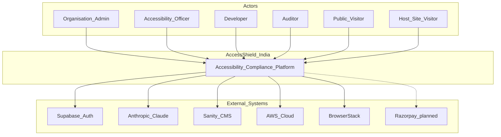
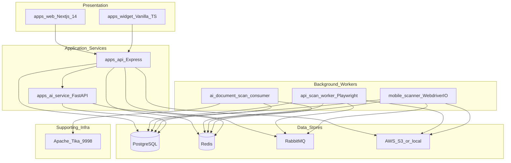

# 01 — System Overview

[← Index](./README.md) | [Next: Monorepo & Packages →](./02-monorepo-and-packages.md)

## Executive Summary

AccessShield India is an AI-powered SaaS platform that helps Indian organisations comply with digital accessibility regulations (RPwD Act, IS 17802, GIGW 3.0, WCAG 2.2 AA, SEBI circular). The system scans websites, documents, and mobile apps; tracks remediation issues; generates reports; and provides an embeddable accessibility widget for customer sites.

---

## C4 Level 1 — System Context

**Interpretation:** Customer staff use the web portal for scans, issues, and reports. Public visitors use the free scan tool and marketing site. End-users on customer websites may use the accessibility widget. The platform delegates identity to Supabase and AI inference to Anthropic.

---

## C4 Level 2 — Containers

---

## Service Responsibility Matrix

| Container           | Technology                   | Default Port        | Responsibility                                              |
| ------------------- | ---------------------------- | ------------------- | ----------------------------------------------------------- |
| **web**             | Next.js 14 App Router        | 3000                | Marketing site, dashboard portal, Sanity blog, API proxy    |
| **api**             | Node 20 + Express 4          | 4000                | REST API, scan orchestration, billing routes, widget API    |
| **api scan worker** | Node + Playwright + axe-core | —                   | Web scans: v1 `scans` queue (default) or v2 staged queues (`scan.jobs` → page/persist/AI/report) when `SCAN_PIPELINE_V2_SCAN_JOBS=true` |
| **ai-service**      | Python 3.11+ FastAPI         | 8001                | AI endpoints + document scan Redis consumer                 |
| **mobile-scanner**  | Node + WebdriverIO           | —                   | Consumes RabbitMQ `mobile-scan-jobs`; Appium/BrowserStack   |
| **widget**          | esbuild bundle               | CDN / static        | Embeddable accessibility toolbar (Shadow DOM)               |
| **PostgreSQL**      | 16                           | 5433 (local Docker) | Primary relational store (Drizzle ORM)                      |
| **Redis**           | 7                            | 6379                | Cache, rate limits, scan progress, document job queue       |
| **RabbitMQ**        | 3.13                         | 5672                | Web scan queues (v1 `scans` and/or v2 stage queues), mobile scans, cancellations |
| **Apache Tika**     | 2.9.2.1                      | 9998                | Document text extraction for PDF scans                      |

---

## Product Capability Map

| Capability                                      | Primary apps             | Status             |
| ----------------------------------------------- | ------------------------ | ------------------ |
| Website / web app scanning                      | api + scan worker        | Implemented        |
| Mobile app scanning (Android/iOS)               | api + mobile-scanner     | Implemented        |
| Document scanning (PDF, DOCX, PPTX, XLSX)       | api + ai-service         | Implemented        |
| Issue tracking & workflow                       | api + web                | Implemented        |
| AI alt-text, fix suggestions, compliance advice | ai-service               | Implemented        |
| Executive / technical reports                   | api reporting module     | Implemented        |
| Accessibility certification badges              | api certification module | Implemented        |
| Embeddable accessibility widget                 | widget + api             | Implemented        |
| Marketing blog (CMS)                            | web + Sanity             | Implemented        |
| Public free scan tool                           | api public routes + web  | Implemented        |
| Billing (Razorpay)                              | api + web                | Planned (UI stub)  |
| Jira integration                                | api integrations route   | Stub (404)         |
| Email / SMS / WhatsApp notifications            | —                        | Planned (env only) |

---

## Compliance Standards Traceability

| Standard                 | Enforced by                                                                         |
| ------------------------ | ----------------------------------------------------------------------------------- |
| **WCAG 2.2 AA**          | axe-core (web scans), document engines, mobile rule engine                          |
| **IS 17802**             | Custom rules in `apps/api/src/scanner/rules/is17802.ts`, mobile `is17802-mobile.ts` |
| **GIGW 3.0**             | Custom rules in `apps/api/src/scanner/rules/gigw.ts`                                |
| **RPwD Act 2016**        | Report types, legal compliance reports                                              |
| **SEBI circular (2024)** | Plan-gated SEBI report type (enterprise/government)                                 |
| **PDF/UA**               | Document PDF engine checkpoints                                                     |

---

## Communication Patterns Summary

| Pattern                  | Used for                                                   |
| ------------------------ | ---------------------------------------------------------- |
| HTTPS + Bearer JWT       | web → api (all protected routes)                           |
| HTTPS + PKCE cookies     | web ↔ Supabase Auth                                        |
| HTTP + `X-Internal-Key`  | api → ai-service                                           |
| RabbitMQ (AMQP)          | Web scans, mobile scans, scan cancellation                 |
| Redis LIST (LPUSH/BLPOP) | Document scan jobs                                         |
| API SSE + Redis          | Dashboard live scan status updates                         |
| S3 / MinIO               | Document download for AI worker; screenshot/report storage |

---

## Known Architecture Notes (for reviewers)

1. **Auth:** Keycloak-only (Auth.js on web, JWKS on API). Supabase client removed — see [09](./09-self-hosting-supabase-replacement.md).
2. **AI enrichment:** v2 workers consume `ai.alt-text` / `ai.fix` (and legacy hyphenated names) after scan finalize via `ai.enrich`. On-demand AI from the issues UI still uses HTTP to ai-service. See [v2](./v2/README.md) and [05](./05-scan-pipelines.md).
3. **README port drift:** Root README references Postgres 5432 and AI port 8000; actual local defaults are **5433** and **8001** (see [08-operational-runbook.md](./08-operational-runbook.md)).

---

## Source References

- Monorepo layout: [`pnpm-workspace.yaml`](../../pnpm-workspace.yaml)
- API bootstrap: [`apps/api/src/index.ts`](../../apps/api/src/index.ts)
- Web entry: [`apps/web/scripts/dev.sh`](../../apps/web/scripts/dev.sh)
- AI entry: [`apps/ai-service/main.py`](../../apps/ai-service/main.py)
- Local infra: [`docker-compose.yml`](../../docker-compose.yml)
