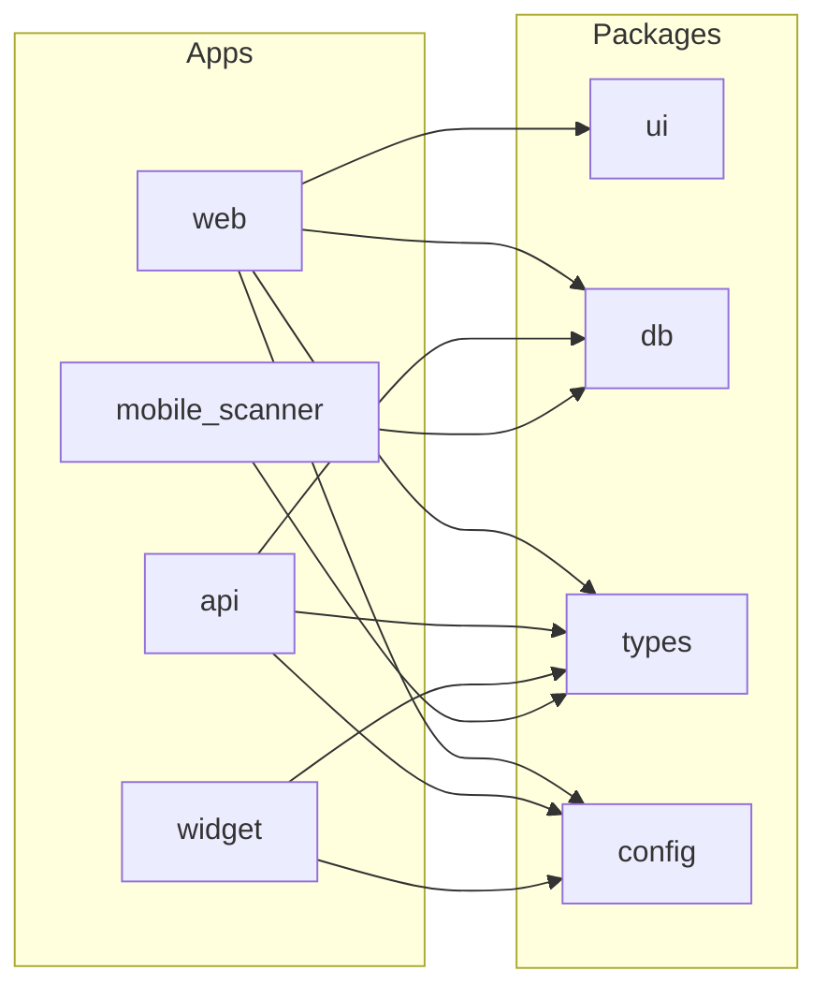

# 02 — Monorepo and Packages

[← System Overview](./01-system-overview.md) | [Index](./README.md) | [Next: Data & Multi-Tenancy →](./03-data-and-multi-tenancy.md)

## Executive Summary

AccessShield is a **Turborepo monorepo** managed with **pnpm 9**. Five deployable apps live under `apps/`; four shared packages under `packages/`. Dependencies flow one way: apps import packages; packages never import apps.

---

## Workspace Layout

```
SourceCode/
├── apps/
│   ├── web/              # Next.js 14 — marketing + dashboard
│   ├── api/              # Express API + scan worker
│   ├── ai-service/       # Python FastAPI
│   ├── widget/           # Vanilla TS CDN bundle
│   └── mobile-scanner/   # Mobile scan worker
├── packages/
│   ├── db/               # Drizzle schema + migrations
│   ├── types/            # Shared TypeScript types
│   ├── ui/               # React component library
│   └── config/           # ESLint, TS, Tailwind configs
├── docs/architecture/    # This documentation set
├── infra/keycloak/       # Keycloak realm import
├── docker-compose.yml    # Local Postgres, Redis, RabbitMQ, Keycloak, MinIO, Tika
├── turbo.json            # Turborepo task graph
└── pnpm-workspace.yaml
```

---

## Apps

| App                | NPM package                    | Entry point                                                                          | Dev port / mode        |
| ------------------ | ------------------------------ | ------------------------------------------------------------------------------------ | ---------------------- |
| **web**            | `@accessshield/web`            | [`apps/web/scripts/dev.sh`](../../apps/web/scripts/dev.sh)                           | **3000**               |
| **api**            | `@accessshield/api`            | [`apps/api/src/index.ts`](../../apps/api/src/index.ts)                               | **4000**               |
| **api worker**     | `@accessshield/api`            | [`apps/api/src/scanner/worker-entry.ts`](../../apps/api/src/scanner/worker-entry.ts) | No HTTP (`dev:worker`) |
| **ai-service**     | `@accessshield/ai-service`     | [`apps/ai-service/main.py`](../../apps/ai-service/main.py)                           | **8001**               |
| **widget**         | `@accessshield/widget`         | [`apps/widget/src/index.ts`](../../apps/widget/src/index.ts)                         | Watch build → `dist/`  |
| **mobile-scanner** | `@accessshield/mobile-scanner` | [`apps/mobile-scanner/src/index.ts`](../../apps/mobile-scanner/src/index.ts)         | Worker only            |

### web — Next.js Portal

- **Stack:** Next.js 14 App Router, React 18, TanStack Query v5, Supabase SSR, Tailwind, Sanity CMS
- **Route groups:**
  - `apps/web/src/app/[locale]/(marketing)/` — Public pages (EN + HI)
  - `apps/web/src/app/dashboard/` — Authenticated portal
  - `apps/web/src/app/auth/callback/` — OAuth PKCE callback
- **Middleware:** [`apps/web/middleware.ts`](../../apps/web/middleware.ts) — auth gate, locale, session refresh
- **API access:** [`apps/web/src/lib/api/client.ts`](../../apps/web/src/lib/api/client.ts) — Bearer token from Supabase session
- **Proxy:** [`apps/web/next.config.js`](../../apps/web/next.config.js) rewrites `/api/v1/*` → `http://localhost:4000/api/v1/*`

### api — Express Backend

- **Stack:** Node 20, Express 4, Drizzle, Playwright, axe-core, amqplib, jose (JWT), ioredis
- **Env loading:** [`apps/api/src/config/env.ts`](../../apps/api/src/config/env.ts) — reads root `.env.local`
- **Modules:** `routes/`, `scanner/`, `reporting/`, `certification/`, `services/`, `middleware/`

### ai-service — Python Microservice

- **Stack:** FastAPI, Anthropic SDK, SQLAlchemy async, redis-py, Pydantic v2
- **Env:** `apps/ai-service/.env` (separate from root `.env.local`)
- **Lifespan:** Starts document scan Redis consumer on startup ([`main.py`](../../apps/ai-service/main.py))

### widget — CDN SDK

- **Stack:** Vanilla TypeScript, esbuild, Shadow DOM (mandatory for style isolation)
- **Target:** &lt; 35KB gzipped
- **Dev:** Built on first `pnpm dev:web` if missing; copied to `apps/web/public/widget.js`

### mobile-scanner — Mobile Worker

- **Stack:** WebdriverIO, Appium (local) or BrowserStack App Automate (cloud)
- **No HTTP server** — RabbitMQ consumer only

---

## Shared Packages



| Package                | Contents                                                        | Consumers                        |
| ---------------------- | --------------------------------------------------------------- | -------------------------------- |
| `@accessshield/db`     | Drizzle schema, `createDb()`, migrations, user-claims lookup    | web, api, mobile-scanner         |
| `@accessshield/types`  | `ApiResponse`, `AccessShieldJwtClaims`, `ProblemDetails`, enums | web, api, widget, mobile-scanner |
| `@accessshield/ui`     | Accessible Radix + Tailwind components                          | web only                         |
| `@accessshield/config` | Shared ESLint, TypeScript, Tailwind presets                     | All apps (dev tooling)           |

**Rule:** Never import from `apps/` into `packages/`.

---

## API Route Map

Mounted in [`apps/api/src/index.ts`](../../apps/api/src/index.ts):

### Public (no JWT)

| Prefix                    | Router          | Purpose                    |
| ------------------------- | --------------- | -------------------------- |
| `GET /health`             | health          | Liveness + DB/Redis check  |
| `GET /`                   | inline          | Service info + web app URL |
| `/api/v1/public/scan`     | public-scan     | Free scan tool             |
| `/api/v1/public/waitlist` | public-waitlist | Marketing waitlist         |
| `/api/v1/public/signup`   | public-signup   | Self-serve signup          |
| `/api/v1/widget` (subset) | public widget   | Widget token verify        |

### Protected (JWT required on `/api/v1/*`)

| Prefix                                    | Router               | Domain                              |
| ----------------------------------------- | -------------------- | ----------------------------------- |
| `/api/v1/assets`                          | assets               | Asset CRUD, mobile APK upload       |
| `/api/v1/dashboard`                       | dashboard            | Dashboard aggregates                |
| `/api/v1/issues`                          | issues               | Issue tracker + AI fix              |
| `/api/v1/scans`                           | scanner orchestrator | Web/mobile scan jobs                |
| `/api/v1/document-scans`                  | document-scans       | Document upload + results           |
| `/api/v1/reports`                         | reporting            | PDF/HTML report generation          |
| `/api/v1/certificates` + `/verify/:token` | certification        | Certs + public verify               |
| `/api/v1/organisation`                    | organisation         | Org settings                        |
| `/api/v1/users`                           | users                | User management                     |
| `/api/v1/billing`                         | billing              | Subscription routes                 |
| `/api/v1/notifications`                   | notifications        | Notification prefs                  |
| `/api/v1/widget`                          | widget               | Widget settings (auth)              |
| `/api/v1/integrations`                    | integrations         | Jira (stub)                         |
| `/api/v1/admin`                           | admin                | Platform admin (`super_admin` only) |

**Auth middleware:** Applied to all `/api/v1` routes after public mounts — [`apps/api/src/middleware/auth.ts`](../../apps/api/src/middleware/auth.ts).

---

## Web Route Map (high level)

| Area           | Path pattern                         | Auth                        |
| -------------- | ------------------------------------ | --------------------------- |
| Marketing (EN) | `/`, `/pricing`, `/scan`, `/blog`, … | Public                      |
| Marketing (HI) | `/hi/...`                            | Public                      |
| Dashboard      | `/dashboard/*`                       | Protected                   |
| Login          | `/login`                             | Public (redirect if authed) |
| Auth callback  | `/auth/callback`                     | OAuth PKCE                  |

Dashboard pages include: assets, scans, issues, reports, certificates, settings, admin (super_admin).

---

## Turborepo Tasks

From [`turbo.json`](../../turbo.json):

| Task                         | Behaviour                                       |
| ---------------------------- | ----------------------------------------------- |
| `build`                      | Depends on `^build`; outputs `.next/`, `dist/`  |
| `dev`                        | Persistent, no cache — long-running dev servers |
| `worker`                     | Persistent — mobile-scanner worker              |
| `db:generate` / `db:migrate` | Drizzle kit                                     |
| `lint`, `type-check`, `test` | CI gates                                        |

Root scripts ([`package.json`](../../package.json)):

- `pnpm dev` — all apps with `dev` script
- `pnpm dev:stack` — web + api only
- `pnpm dev:web` / `pnpm dev:api` — individual apps
- `pnpm dev:stop` — kill processes on ports 3000, 4000, 8000, 8001

---

## Source References

- Workspace: [`pnpm-workspace.yaml`](../../pnpm-workspace.yaml)
- Turbo config: [`turbo.json`](../../turbo.json)
- UI exports: [`packages/ui/src/index.ts`](../../packages/ui/src/index.ts)
- Types: [`packages/types/src/index.ts`](../../packages/types/src/index.ts)
