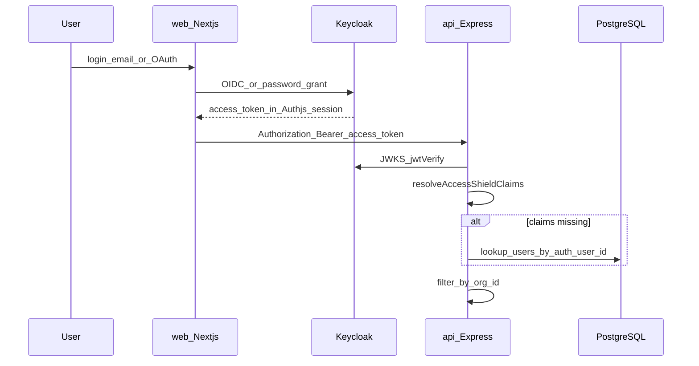

# 04 — Auth and Security

[← Data & Multi-Tenancy](./03-data-and-multi-tenancy.md) | [Index](./README.md) | [Next: Scan Pipelines →](./05-scan-pipelines.md)

## Executive Summary

End-user authentication is delegated to **Keycloak** (OIDC / Auth.js BFF, httpOnly cookies). The API validates **Bearer JWTs** via Keycloak JWKS and enforces **RBAC** plus **organisation isolation**. Internal AI calls use a shared secret header. Production secrets load from **AWS Secrets Manager**. See [09-self-hosting-supabase-replacement.md](./09-self-hosting-supabase-replacement.md).

---

## Authentication Flow

**Interpretation:** Users never send org_id manually. The JWT (or DB fallback) supplies tenant context.

---

## Key Components

| Layer            | File                                                                                       | Responsibility                   |
| ---------------- | ------------------------------------------------------------------------------------------ | -------------------------------- |
| Auth.js config   | [`apps/web/src/lib/auth/auth-options.ts`](../../apps/web/src/lib/auth/auth-options.ts)     | Keycloak + credentials providers |
| Session helpers  | [`apps/web/src/lib/auth/session.ts`](../../apps/web/src/lib/auth/session.ts)               | Server access token for API      |
| Route protection | [`apps/web/middleware.ts`](../../apps/web/middleware.ts)                                   | Dashboard auth gate              |
| Token for API    | [`apps/web/src/lib/api/client.ts`](../../apps/web/src/lib/api/client.ts)                   | `getAccessToken()` → Bearer      |
| JWT verification | [`apps/api/src/middleware/auth.ts`](../../apps/api/src/middleware/auth.ts)                 | jose + Keycloak JWKS             |
| Claims           | [`apps/api/src/lib/resolve-claims.ts`](../../apps/api/src/lib/resolve-claims.ts)           | Claims or DB fallback            |
| Identity admin   | [`apps/api/src/services/identity-admin.ts`](../../apps/api/src/services/identity-admin.ts) | Keycloak Admin provisioning      |

### JWT claims

- `sub` — Keycloak user ID (`users.auth_user_id`)
- `user_role`, `org_id` — custom claims / attributes
- `email`, `iat`, `exp`

---

## RBAC

Roles: `super_admin`, `customer_admin`, `accessibility_officer`, `developer`, `auditor`  
Enforced via [`apps/api/src/middleware/rbac.ts`](../../apps/api/src/middleware/rbac.ts).

---

## Service-to-Service

| Path | Mechanism |
| --- | --- |
| API → AI | `X-Internal-Key` / `X-Org-Id` / `X-Org-Plan` |
| API → Keycloak Admin | Service-account client credentials ([`keycloak-admin.ts`](../../apps/api/src/services/keycloak-admin.ts)) |

Widget embed tokens use opaque `JWT_SECRET` hashing — not Keycloak user JWTs.

---

## Secrets

**Required API keys:** `DATABASE_URL`, `REDIS_URL`, `RABBITMQ_URL`, `AUTH_ISSUER_URL`, `KEYCLOAK_URL`, `KEYCLOAK_REALM`, `KEYCLOAK_ADMIN_CLIENT_ID`, `KEYCLOAK_ADMIN_CLIENT_SECRET`

---

## Realtime

API SSE + Redis: [`apps/api/src/routes/realtime.ts`](../../apps/api/src/routes/realtime.ts), [`useRealtime.ts`](../../apps/web/src/lib/hooks/useRealtime.ts).

---

## Source References

- Login: [`LoginForm.tsx`](../../apps/web/src/components/marketing/LoginForm.tsx)
- Sysadmin seed: [`scripts/seed-sysadmin.sh`](../../scripts/seed-sysadmin.sh)
- Design: [09-self-hosting-supabase-replacement.md](./09-self-hosting-supabase-replacement.md)
