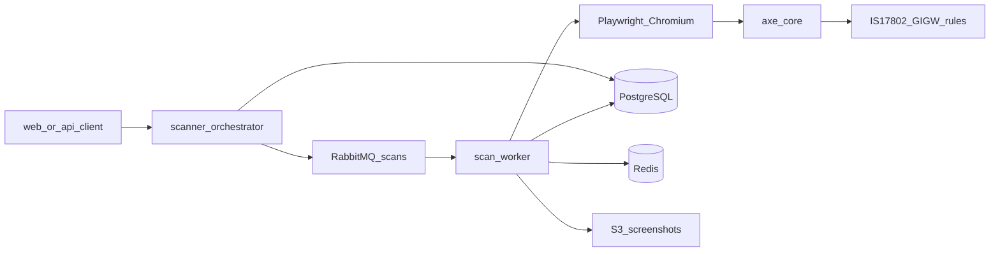
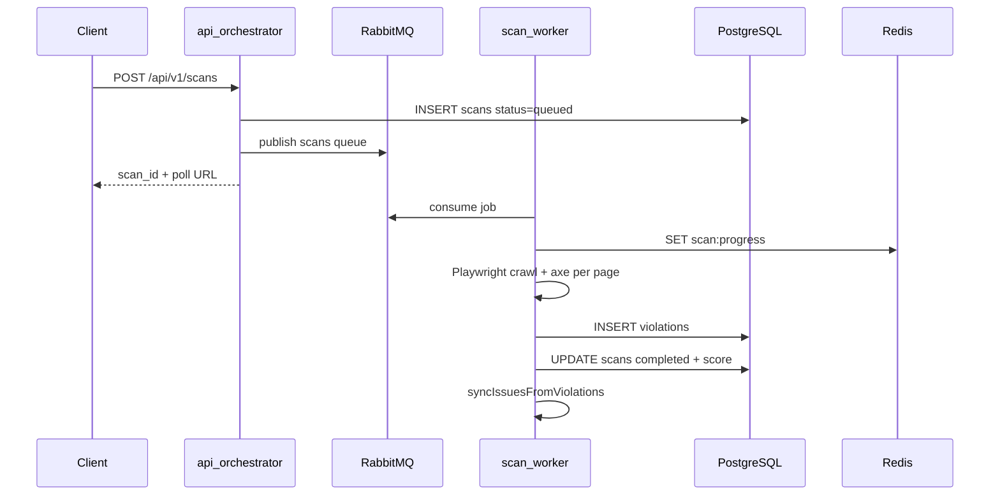
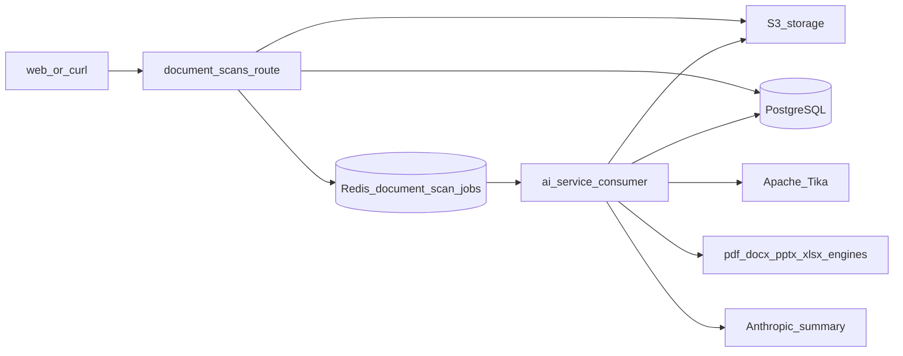
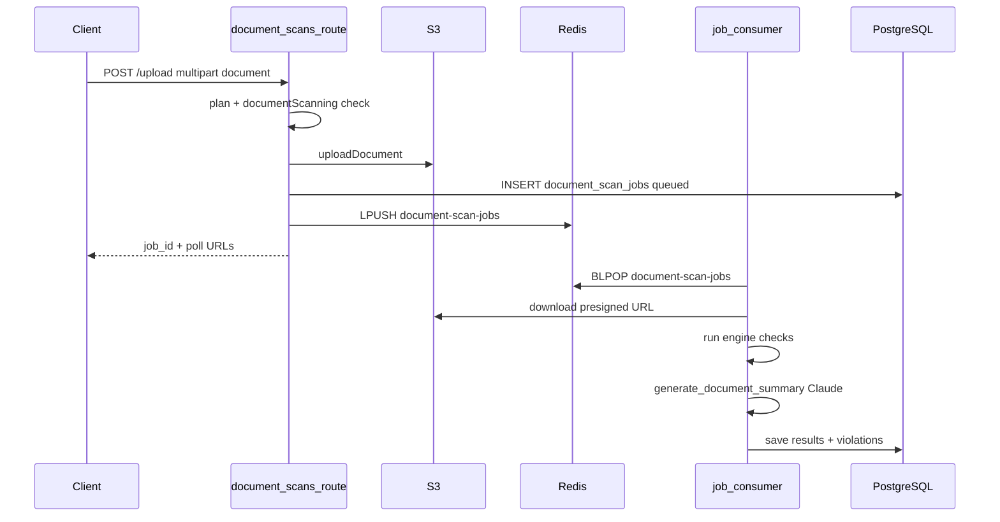
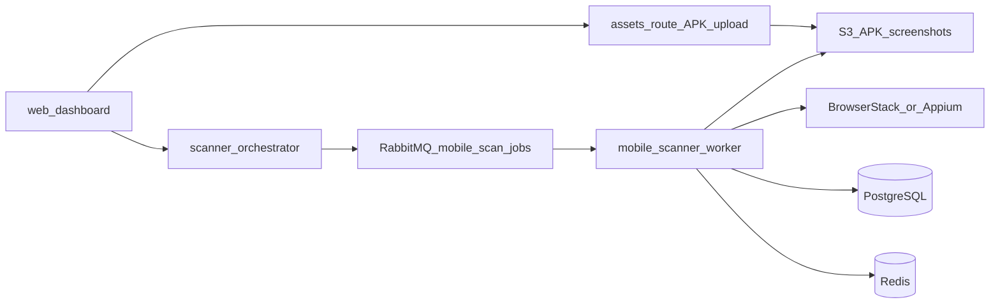
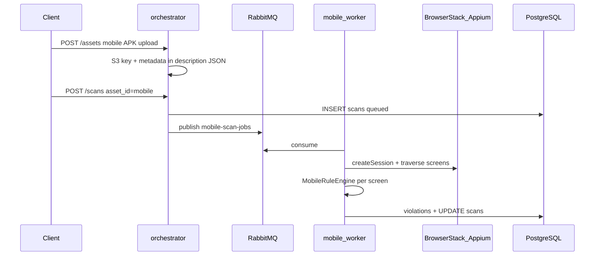

# 05 — Scan Pipelines

[← Auth & Security](./04-auth-and-security.md) | [Index](./README.md) | [Next: AI & Integrations →](./06-ai-and-integrations.md)

## Executive Summary

AccessShield runs **three independent scan pipelines**: web (Playwright + axe-core), document (PDF/DOCX/PPTX/XLSX via AI service), and mobile (Appium/BrowserStack). Each uses different queues and workers but shares PostgreSQL for results and Redis for progress tracking.

> **Web scan v2 (feature-flagged):** Staged task-queue pipeline (crawler → page.scan → findings.persist → finalize → issues.sync / ai.enrich / report.generate). Enable with `SCAN_PIPELINE_V2_SCAN_JOBS=true` on API + worker. Docs: [Architecture v2](./v2/README.md) · [change plan](./v2/02-scan-pipeline-change-plan.md) · [PROGRESS](./v2/PROGRESS.md).  
> **Default (flags off):** This document’s **v1 monolith** path on RabbitMQ queue `scans`.

---

## Pipeline Comparison

| Aspect           | Web scanner (v1 default)            | Web scanner (v2 flags on)                          | Document scanner                     | Mobile scanner                      |
| ---------------- | ----------------------------------- | -------------------------------------------------- | ------------------------------------ | ----------------------------------- |
| **Trigger**      | `POST /api/v1/scans`                | same                                               | `POST /api/v1/document-scans/upload` | `POST /api/v1/scans` (mobile asset) |
| **Queue**        | RabbitMQ `scans`                    | `scan.jobs` → `page.scan` → `findings.persist` …   | Redis `document-scan-jobs`           | RabbitMQ `mobile-scan-jobs`         |
| **Worker**       | api `dev:worker` (monolith)         | same entry; multiple consumers in-process          | ai-service lifespan consumer         | mobile-scanner                      |
| **Engine**       | Playwright, axe-core, IS17802, GIGW | same engines, staged                               | PDF/DOCX/PPTX/XLSX engines + Tika    | TraversalAgent + MobileRuleEngine   |
| **Progress key** | `scan:progress:{id}`                | same + `scan:barrier:{id}`, `scan_page_jobs`       | DB `progress_percent`                | `mobile-scan:progress:{id}`         |
| **Artifacts**    | Screenshots → S3                    | same + optional auto `report.generate`             | Original file → S3                   | APK/IPA → S3, screen shots          |

---

## A. Web Scanner Pipeline

### Architecture



### Sequence



### Step-by-step

1. **Validate** asset, plan limits, org scope — [`apps/api/src/scanner/orchestrator.ts`](../../apps/api/src/scanner/orchestrator.ts)
2. **Insert** `scans` row (`status: queued`)
3. **Publish** to RabbitMQ queue `scans` — [`apps/api/src/scanner/queue.ts`](../../apps/api/src/scanner/queue.ts)
4. **Worker consumes** — [`apps/api/src/scanner/worker-entry.ts`](../../apps/api/src/scanner/worker-entry.ts) → [`worker.ts`](../../apps/api/src/scanner/worker.ts)
5. **Crawl** URLs — [`crawler.ts`](../../apps/api/src/scanner/crawler.ts)
6. **Run** axe-core per page — [`axe-runner.ts`](../../apps/api/src/scanner/axe-runner.ts)
7. **Apply** India rules — [`rules/is17802.ts`](../../apps/api/src/scanner/rules/is17802.ts), [`rules/gigw.ts`](../../apps/api/src/scanner/rules/gigw.ts)
8. **Store** violations, screenshots, compliance score
9. **Sync** issues — issue sync service
10. **Optional:** publish `ai-alt-text` / `ai-fix` to RabbitMQ (no in-repo consumer — on-demand AI uses HTTP)

### Cancellation

`POST /api/v1/scans/:id/cancel` → RabbitMQ `scan_cancellations` → worker marks scan in `cancelledScans` set.

### Public free scan

`POST /api/v1/public/scan` — [`apps/api/src/routes/public-scan.ts`](../../apps/api/src/routes/public-scan.ts) — no per-email daily cap; soft IP abuse limit, no JWT.

On completion, the scan worker emails a summary report (score, severity counts, top 5 issues) to the lead email in Redis (`public-scan:lead:{scanId}`) via Resend. Requires `RESEND_API_KEY` on the **API worker** (optional `EMAIL_FROM`, `NEXT_PUBLIC_APP_URL` for links). Idempotent via `public-scan:email-sent:{scanId}`.

### Run locally

```bash
# v1 (default)
pnpm --filter @accessshield/api dev:worker

# v2 full pipeline (API + worker must share flags)
# SCAN_PIPELINE_V2_SCAN_JOBS=true
pnpm --filter @accessshield/api dev:worker
```

Requires RabbitMQ + Redis + Postgres. For v2 also run migrations `0005`+`0006` (or `pnpm --filter @accessshield/db db:migrate`).

---

## B. Document Scanner Pipeline

### Architecture



### Sequence



### Step-by-step

1. **Upload** — multer field `document`, max 50MB — [`apps/api/src/routes/document-scans.ts`](../../apps/api/src/routes/document-scans.ts)
2. **Plan gate** — `documentScanning` feature + monthly limit
3. **S3 upload** — [`apps/api/src/services/document-storage.ts`](../../apps/api/src/services/document-storage.ts)
4. **Insert** `document_scan_jobs`
5. **Enqueue** Redis — [`apps/api/src/services/document-scan-queue.ts`](../../apps/api/src/services/document-scan-queue.ts)
6. **Consumer** — [`apps/ai-service/services/document_scanner/job_consumer.py`](../../apps/ai-service/services/document_scanner/job_consumer.py) (started in FastAPI lifespan)
7. **Engines** — `pdf_engine.py`, `docx_engine.py`, `pptx_engine.py`, `xlsx_engine.py`
8. **Tika** — text extraction fallback — `http://localhost:9998`
9. **AI summary** — [`ai_summary.py`](../../apps/ai-service/services/document_scanner/ai_summary.py)
10. **Persist** — [`db_writer.py`](../../apps/ai-service/services/document_scanner/db_writer.py)

### Direct scan (dev/test)

`POST /document-scanner/scan` on AI service — synchronous, no queue — [`router.py`](../../apps/ai-service/services/document_scanner/router.py).

### Poll endpoints

- `GET /api/v1/document-scans/:jobId/status`
- `GET /api/v1/document-scans/:jobId/results`

### Run locally

Requires: api + ai-service + Redis + Tika (`docker compose up -d tika`).

---

## C. Mobile Scanner Pipeline

### Architecture



### Sequence



### Step-by-step

1. **Upload APK/IPA** — `POST /api/v1/assets` with `type: mobile_app` — [`apps/api/src/routes/assets.ts`](../../apps/api/src/routes/assets.ts)
2. **Metadata** — JSON in `description` field — [`apps/api/src/lib/mobile-asset.ts`](../../apps/api/src/lib/mobile-asset.ts)
3. **Trigger scan** — orchestrator detects `mobile_app` → [`publishMobileScanJob`](../../apps/api/src/scanner/mobile-queue.ts)
4. **Worker** — [`apps/mobile-scanner/src/worker.ts`](../../apps/mobile-scanner/src/worker.ts)
5. **Device** — BrowserStack (preferred) or local Appium — [`device-manager.ts`](../../apps/mobile-scanner/src/device-manager.ts)
6. **Traversal** — [`traversal-agent.ts`](../../apps/mobile-scanner/src/traversal-agent.ts)
7. **Rules** — IS 17802 mobile rules — [`rules/is17802-mobile.ts`](../../apps/mobile-scanner/src/rules/is17802-mobile.ts)

### Run locally

```bash
pnpm --filter @accessshield/mobile-scanner dev
```

Requires: RabbitMQ, Redis, Postgres, S3 creds or local storage, BrowserStack env vars (recommended).

---

## Hybrid AI Enrichment (web scans)

**v2 (flags on):** After finalize, worker publishes `ai.enrich` → `ai.alt-text` / `ai.fix`. Consumers in `apps/api/src/scanner/v2/` call ai-service (Anthropic). Plan-gated (`aiRemediation`) + Redis hourly rate limits. Scan completes before AI columns fill.

**v1 / on-demand UI:** Issues UI uses **synchronous HTTP**:

`issues route` → [`apps/api/src/lib/ai-client.ts`](../../apps/api/src/lib/ai-client.ts) → ai-service

Legacy queue names `ai-alt-text` / `ai-fix` are also consumed by the v2 remediation worker for backward compatibility. Prefer `ai.alt-text` / `ai.fix`.

---

## Scalability Notes

| Pipeline       | Horizontal scaling                                                                                                                                |
| -------------- | ------------------------------------------------------------------------------------------------------------------------------------------------- |
| Web scans (v1) | Multiple `dev:worker` / Lambda instances consuming `scans` queue |
| Web scans (v2) | Scale worker processes; consumers share `page.scan` / `findings.persist` (prefetch auto-tuned) |
| Mobile scans   | Multiple mobile-scanner containers                                                                                                                |
| Document scans | One BLPOP consumer per ai-service instance; scale ai-service replicas (ensure single consumer per queue partition or use consumer groups pattern) |

---

## Source References

- Web orchestrator: [`apps/api/src/scanner/orchestrator.ts`](../../apps/api/src/scanner/orchestrator.ts)
- Document routes: [`apps/api/src/routes/document-scans.ts`](../../apps/api/src/routes/document-scans.ts)
- Mobile entry: [`apps/mobile-scanner/src/index.ts`](../../apps/mobile-scanner/src/index.ts)
- Score calculation: [`apps/api/src/scanner/score.ts`](../../apps/api/src/scanner/score.ts)
