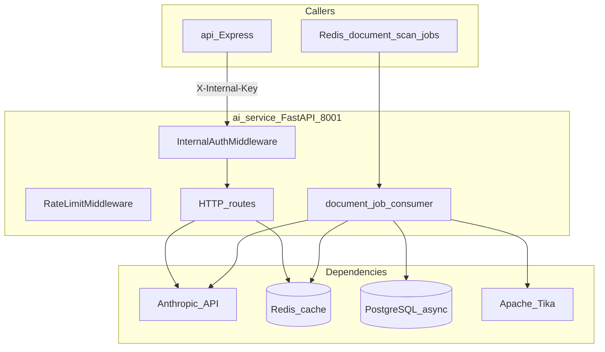

# 06 — AI and Integrations

[← Scan Pipelines](./05-scan-pipelines.md) | [Index](./README.md) | [Next: Deployment Topology →](./07-deployment-topology.md)

## Executive Summary

The **ai-service** (FastAPI) centralises Claude-powered features: alt-text, fix suggestions, compliance advice, accessibility statements, and document scan processing. External integrations span Supabase, Anthropic, Sanity, AWS, and BrowserStack — with several billing/comms integrations planned but not yet implemented.

---

## AI Service Architecture

---

## HTTP Endpoints

Source: [`apps/ai-service/main.py`](../../apps/ai-service/main.py)

| Method | Path                          | Auth         | Purpose                           |
| ------ | ----------------------------- | ------------ | --------------------------------- |
| `GET`  | `/health`                     | No           | Liveness + Redis status           |
| `GET`  | `/metrics`                    | No           | Prometheus metrics                |
| `POST` | `/ai/alt-text`                | Internal key | Generate image alt text           |
| `POST` | `/ai/fix`                     | Internal key | Violation fix suggestion          |
| `POST` | `/ai/advise`                  | Internal key | Plain-English compliance advice   |
| `POST` | `/ai/accessibility-statement` | Internal key | EN + HI statement generation      |
| `POST` | `/document-scanner/scan`      | Internal key | Direct document upload scan (dev) |
| `GET`  | `/document-scanner/health`    | No           | Document scanner module health    |

### Service modules

| Module                  | File                                                                                       |
| ----------------------- | ------------------------------------------------------------------------------------------ |
| Alt text                | [`services/alt_text.py`](../../apps/ai-service/services/alt_text.py)                       |
| Fix suggestions         | [`services/fix_suggestion.py`](../../apps/ai-service/services/fix_suggestion.py)           |
| Compliance advice       | [`services/compliance_advisor.py`](../../apps/ai-service/services/compliance_advisor.py)   |
| Accessibility statement | [`services/statement_generator.py`](../../apps/ai-service/services/statement_generator.py) |
| Document scanner        | [`services/document_scanner/`](../../apps/ai-service/services/document_scanner/)           |

### Claude configuration

From [`apps/ai-service/config.py`](../../apps/ai-service/config.py):

- Model: `claude-sonnet-4-5-20250929` (configurable via `CLAUDE_MODEL`)
- Max tokens per endpoint (alt-text 256, fix 1024, advice 512, statement 2048)
- Temperature: low for fix/code (0.1), higher for advice (0.3)

### DLP (mandatory)

All content sent to Anthropic passes through [`utils/dlp.py`](../../apps/ai-service/utils/dlp.py) — redacts Aadhaar, PAN, Indian phone numbers, email, credit card, IFSC.

---

## Redis Caching Pattern

| Aspect     | Value                                         |
| ---------- | --------------------------------------------- |
| Key format | SHA-256(`service_name` + `:` + input_hash)    |
| TTL        | 86400 seconds (24 hours)                      |
| Cached     | Alt text, fix suggestions                     |
| Not cached | Compliance advice (context-sensitive), errors |

Implementation: [`apps/ai-service/utils/cache.py`](../../apps/ai-service/utils/cache.py)

---

## API → AI Client

[`apps/api/src/lib/ai-client.ts`](../../apps/api/src/lib/ai-client.ts)

- Base URL: `AI_SERVICE_URL` (default `http://localhost:8001`)
- Headers: `X-Internal-Key`, `X-Org-Id`, `X-Org-Plan`
- Used from: issues routes (AI fix panel), reporting, on-demand enrichment

### Scan Pipeline v2 (async)

When `SCAN_PIPELINE_V2_SCAN_JOBS=true`, the **api scan worker** also consumes RabbitMQ AI queues after finalize (`ai.enrich` → `ai.alt-text` / `ai.fix`). Those workers call the same ai-service HTTP endpoints; they do **not** block scan `completed`. Rate limits and plan gates live in Redis (`scanner/v2/ai-rate-limit.ts`). See [Architecture v2](./v2/README.md).

---

## External Integration Matrix

| Integration             | Status      | Used by             | Env vars / notes                                                                                 |
| ----------------------- | ----------- | ------------------- | ------------------------------------------------------------------------------------------------ |
| **Keycloak**            | Implemented | web, api            | `AUTH_ISSUER_URL`, `KEYCLOAK_*`, `NEXT_PUBLIC_AUTH_*` — Auth / JWKS / Admin API                   |
| **MinIO / AWS S3**      | Implemented | api, mobile-scanner | `S3_ENDPOINT`, `S3_BUCKET_NAME`, `AWS_*` — artifacts                                             |
| **AWS Secrets Manager** | Implemented | api (prod)          | `AWS_SECRET_ID`, `AWS_REGION`                                                                    |
| **CloudFront**          | Implemented | api, mobile-scanner | `CLOUDFRONT_URL` — CDN URLs for artifacts                                                        |
| **BrowserStack**        | Implemented | mobile-scanner      | `BROWSERSTACK_USERNAME`, `BROWSERSTACK_ACCESS_KEY`                                               |
| **Apache Tika**         | Implemented | ai-service          | Docker service port 9998; `TIKA_SERVER_URL`                                                      |
| **Razorpay**            | Planned     | web billing UI stub | Keys in `.cursorrules`; no API SDK wired                                                         |
| **Jira**                | Stub        | api integrations    | Returns 404 — [`apps/api/src/routes/integrations.ts`](../../apps/api/src/routes/integrations.ts) |
| **Resend**              | Planned     | —                   | `RESEND_API_KEY` in env template only                                                            |
| **MSG91**               | Planned     | —                   | SMS OTP — env only                                                                               |
| **Interakt**            | Planned     | —                   | WhatsApp — env only                                                                              |
| **Zoho Books**          | Planned     | —                   | GST invoicing — env only                                                                         |

---

## Sanity CMS (Marketing Blog)

- Client: [`apps/web/src/sanity/client.ts`](../../apps/web/src/sanity/client.ts)
- Queries: [`apps/web/src/lib/sanity.ts`](../../apps/web/src/lib/sanity.ts)
- Studio: external repo (`studio-accessshield` per `.env.example` comment)
- Content: blog posts, legal pages (where migrated)

---

## Widget Integration

| Step   | Detail                                                             |
| ------ | ------------------------------------------------------------------ |
| Embed  | `<script src="..." data-token="...">`                              |
| Verify | `GET /api/v1/widget/verify?token=`                                 |
| Prefs  | `localStorage` key `as_widget_{token}`                             |
| CDN    | `NEXT_PUBLIC_CDN_URL` prod; dev serves `apps/web/public/widget.js` |

---

## Knowledge Bases (AI advice)

Loaded at AI service startup — [`services/compliance_advisor.py`](../../apps/ai-service/services/compliance_advisor.py):

- WCAG 2.2 criteria — [`data/wcag22.json`](../../apps/ai-service/data/wcag22.json)
- IS 17802 rules — [`data/is17802.json`](../../apps/ai-service/data/is17802.json)

---

## Integration Roadmap (for TPMs)

| Priority | Integration      | Blocker / note                               |
| -------- | ---------------- | -------------------------------------------- |
| P0       | Razorpay billing | API routes + webhook HMAC verification       |
| P1       | Resend email     | Transactional scan complete, invite emails   |
| P2       | Jira OAuth       | OAuth flow started in web settings; API stub |
| P3       | MSG91 / Interakt | OTP and WhatsApp notifications               |

---

## Source References

- AI pyproject: [`apps/ai-service/pyproject.toml`](../../apps/ai-service/pyproject.toml)
- AI env template: [`apps/ai-service/.env.example`](../../apps/ai-service/.env.example)
- Rate limits: [`apps/ai-service/middleware/rate_limiter.py`](../../apps/ai-service/middleware/rate_limiter.py)
