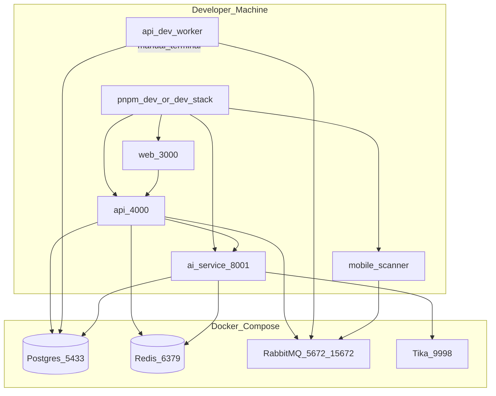
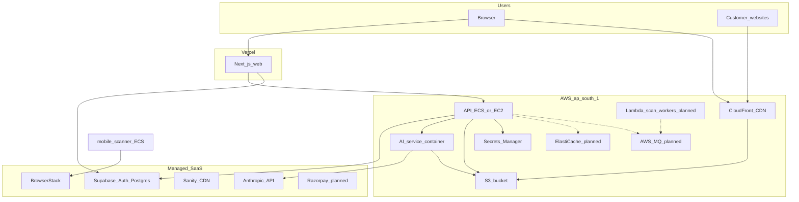

# 07 — Deployment Topology

[← AI & Integrations](./06-ai-and-integrations.md) | [Index](./README.md) | [Next: Operational Runbook →](./08-operational-runbook.md)

For step-by-step setup, use **[11-deployment-guide.md](./11-deployment-guide.md)**.

## Executive Summary

**Local development** runs application code on the host via `pnpm` filters / `pnpm dev`, with backing services in **Docker Compose** (Postgres with DBs `accessshield` + `keycloak`, Redis, RabbitMQ, Tika, **Keycloak**, **MinIO**, Mailpit). **Production target** deploys web to **Vercel**, API and workers to **AWS ap-south-1 (Mumbai)**, auth to **Keycloak** (ECS/EC2 + RDS-backed), Postgres to **RDS**, and static assets to **S3 + CloudFront**.

---

## Local Development Topology

### Docker Compose services

From [`docker-compose.yml`](../../docker-compose.yml):

| Service        | Image                    | Host port       | Notes                       |
| -------------- | ------------------------ | --------------- | --------------------------- |
| postgres       | postgres:16-alpine       | **5433** → 5432 | DB name `accessshield`      |
| redis          | redis:7-alpine           | 6379            | AOF persistence             |
| rabbitmq       | rabbitmq:3.13-management | 5672, 15672     | User `accessshield`         |
| tika           | apache/tika:2.9.2.1      | 9998            | Document text extraction    |
| mobile-scanner | Built Dockerfile         | —               | Optional; prod-style worker |

**Not in Compose:** web, api, ai-service — started via pnpm on host.

---

## Production Target Topology

**Interpretation:** Solid lines = implemented patterns. Dashed = planned per [`.cursorrules`](../../.cursorrules) (ElastiCache, AWS MQ, Lambda workers). Supabase may host Postgres in early prod; RDS is the long-term target for full control.

---

## Environment Comparison

| Component        | Local dev                   | Production target                  |
| ---------------- | --------------------------- | ---------------------------------- |
| **Web**          | `localhost:3000`            | Vercel (`accessshield.in`)         |
| **API**          | `localhost:4000`            | AWS (ECS/EC2/Lambda URL)           |
| **AI service**   | `localhost:8001`            | AWS container service              |
| **Postgres**     | Docker `:5433`              | Supabase hosted / AWS RDS          |
| **Redis**        | Docker `:6379`              | Upstash (dev) / ElastiCache (prod) |
| **RabbitMQ**     | Docker `:5672`              | CloudAMQP (dev) / AWS MQ (prod)    |
| **Secrets**      | `.env.local`                | AWS Secrets Manager                |
| **File storage** | Local filesystem fallback   | S3 `ap-south-1`                    |
| **Widget CDN**   | `apps/web/public/widget.js` | CloudFront                         |
| **Tika**         | Docker `:9998`              | Sidecar or managed doc service     |

---

## Network Boundaries and Egress

| From           | To                  | Protocol         | Purpose                  |
| -------------- | ------------------- | ---------------- | ------------------------ |
| Browser        | Vercel / CloudFront | HTTPS            | Web + widget JS          |
| Browser        | Supabase            | HTTPS            | Auth, Realtime           |
| web (SSR)      | api                 | HTTPS / internal | Server-side API calls    |
| api            | Supabase JWKS       | HTTPS            | JWT verification         |
| api            | ai-service          | HTTP(S) internal | AI requests              |
| ai-service     | Anthropic API       | HTTPS            | Claude inference         |
| mobile-scanner | BrowserStack API    | HTTPS            | Cloud device sessions    |
| api / workers  | S3                  | HTTPS            | Artifact upload/download |

**India data residency:** Primary AWS region `ap-south-1` (Mumbai) per project conventions.

---

## CI/CD Touchpoints

| Gate        | Command                       | Purpose                  |
| ----------- | ----------------------------- | ------------------------ |
| Lint        | `pnpm lint`                   | ESLint + jsx-a11y        |
| Type check  | `pnpm type-check`             | TypeScript strict        |
| Test        | `pnpm test`                   | Unit tests               |
| Build       | `pnpm build`                  | Turbo build all apps     |
| Widget size | `pnpm --filter widget build`  | Bundle &lt; 35KB gzipped |
| A11y tests  | `pnpm --filter web test:a11y` | axe on components        |

Orchestration: [`turbo.json`](../../turbo.json)

---

## Deployment Units

| Unit           | Artifact                                        | Deploy target                |
| -------------- | ----------------------------------------------- | ---------------------------- |
| web            | Next.js build output                            | Vercel                       |
| api            | `tsc` → `dist/`                                 | Node container / PM2         |
| api worker     | Same image, different entry (`worker-entry.ts`) | Separate process / Lambda    |
| ai-service     | Python + uvicorn                                | Container (port 8001)        |
| mobile-scanner | `tsc` → `dist/`                                 | ECS task / Docker Compose    |
| widget         | `widget.min.js`                                 | S3 + CloudFront invalidation |

Scan Pipeline **v2** runs as additional consumers inside the same api worker process (feature-flagged). Keep `SCAN_PIPELINE_V2_*` identical on **api** and **api worker**. Details: [v2/](./v2/README.md), [11 — Deployment](./11-deployment-guide.md).

---

## High Availability Considerations

| Service      | Strategy                                            |
| ------------ | --------------------------------------------------- |
| API          | Horizontal replicas behind ALB; stateless           |
| Scan workers | Scale RabbitMQ consumers independently              |
| AI service   | Replicas; watch document Redis consumer duplication |
| Postgres     | Supabase HA / RDS Multi-AZ                          |
| Redis        | ElastiCache cluster mode                            |
| S3           | Regional durability; CloudFront edge cache          |

---

## Disaster Recovery (outline)

- **Database:** Supabase/RDS automated backups; Drizzle migrations versioned in git
- **S3:** Versioning enabled on production bucket (recommended)
- **Secrets:** AWS Secrets Manager rotation policy
- **RTO/RPO:** Define per SLA tier — not yet codified in repo

---

## Source References

- Infrastructure rules: [`.cursorrules`](../../.cursorrules) sections 2, 3, 18
- API secrets loader: [`apps/api/src/config/secrets.ts`](../../apps/api/src/config/secrets.ts)
- AI Dockerfile: [`apps/ai-service/Dockerfile`](../../apps/ai-service/Dockerfile)
- Mobile scanner Dockerfile: [`apps/mobile-scanner/Dockerfile`](../../apps/mobile-scanner/Dockerfile)
