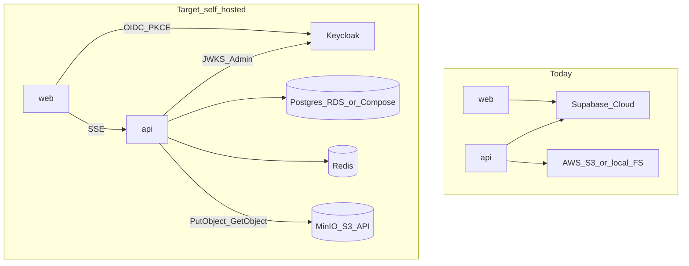
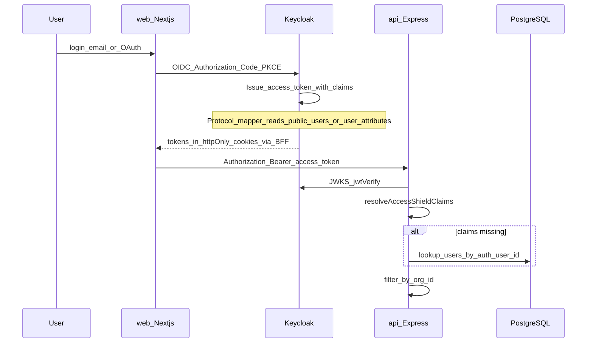
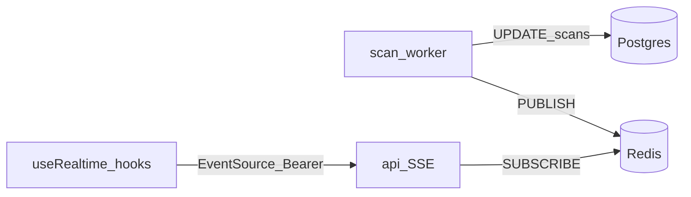

# 09 — Self-Hosting: Supabase Replacement Design

[← Operational Runbook](./08-operational-runbook.md) | [Index](./README.md)

## Executive Summary

This document turns the **Supabase replacement inventory** into an implementation design for self-hosting. It covers direction, Auth/JWKS/Admin/claims, Realtime, `auth.users` / RLS migration, and env/secrets cutover.

**Status:** Cutover complete — Keycloak-only auth (no Supabase client). Compose Keycloak/MinIO, API `IdentityAdmin` + JWKS, web Auth.js BFF, MinIO S3 client, SSE realtime, and document-scan FK migration are in the codebase.

**Inventory baseline:** Actively used Supabase capabilities are Auth (GoTrue), Realtime (`postgres_changes`), `auth.users` + Auth-tied RLS (document scanner), and optionally hosted Postgres. Storage, PostgREST, Studio, and Edge Functions are unused by the app.

---

## 1. Direction Decision

### Chosen approach: replace with non-Supabase alternatives

| Option | Decision |
| --- | --- |
| Self-host full Supabase stack (GoTrue + Realtime + Kong + …) | **Rejected** for target architecture |
| Replace with first-party / AWS-aligned services | **Accepted** |

**Why not self-host Supabase:**

- Document-scanner SQL already couples to `auth.users` / `auth.uid()` — staying on GoTrue keeps that coupling forever.
- Dual migration paths (`packages/db/migrations/` vs `supabase/migrations/`) stay fragmented.
- Plan todos explicitly require migrating off `auth.users` and cutting over `SUPABASE_*` env vars.
- Prod target already prefers **RDS + S3 + ElastiCache**; Auth/Realtime should follow the same ownership model.

**Target stack (defaults):**

| Capability | Replacement |
| --- | --- |
| Identity / sessions / OAuth | **Keycloak** (OIDC) in Docker (dev) / ECS (prod) |
| User access / refresh JWTs | **Issued only by Keycloak** — no custom user-JWT signing in AccessShield |
| JWT verify (API) | Keycloak realm JWKS (`jose` verify only — never mint user tokens) |
| User provisioning (Admin API) | Keycloak Admin REST API (service account) |
| Custom claims (`user_role`, `org_id`) | Keycloak protocol mapper + optional API DB fallback |
| Realtime | **API SSE** + Redis pub/sub (reuse existing Redis) |
| Postgres | Keep Compose Postgres (dev) / **RDS** (prod) — never Supabase-hosted |
| Object storage | **MinIO** (dev / self-host) via S3 SDK; optional real **AWS S3** in cloud prod |
| Auth emails (dev) | Mailpit or existing SMTP (Resend in prod later) |
| Widget embed token | Keep opaque HMAC/hash (`JWT_SECRET`) — **not** a Keycloak user JWT |



**Migration principle:** Keep JWT claim shape (`sub`, `user_role`, `org_id`, `email`) so RBAC and org isolation in Express stay stable while clients and IdP change.

### Decisions locked (product questions)

**MinIO instead of S3?** Yes for self-hosted / local. Keep `@aws-sdk/client-s3` and point `S3Client` at MinIO (`endpoint`, `forcePathStyle: true`). Same bucket/key code paths as today ([`s3-upload.ts`](../../apps/api/src/services/s3-upload.ts), document-storage, scanner screenshots). Cloud prod may still use real AWS S3 with the same env shape — MinIO is the self-host stand-in, not a second storage API.

**Keycloak instead of custom JWT generation?** Yes for **user** auth. AccessShield must **not** implement custom access/refresh token minting for portal/API users. Keycloak issues tokens; API only verifies via JWKS and resolves claims. Do **not** confuse with:

| Token | Owner | Notes |
| --- | --- | --- |
| User access JWT | Keycloak | Replaces Supabase Auth JWTs |
| Widget embed token | AccessShield | Today: SHA-256 of `orgId:JWT_SECRET` in [`widget.ts`](../../apps/api/src/routes/widget.ts) — opaque site token, not end-user login. Keep out of Keycloak. |
| `INTERNAL_AI_SERVICE_KEY` | Shared secret | Service-to-service; not a JWT |

---

## 2. Auth + JWKS + Admin API + Claims Injection

### 2.1 Current behaviour (must preserve)

| Concern | Today |
| --- | --- |
| Browser login | `@supabase/ssr` PKCE, httpOnly cookies |
| OAuth | `signInWithOAuth` + [`apps/web/src/app/auth/callback/route.ts`](../../apps/web/src/app/auth/callback/route.ts) |
| API auth | Bearer access token; JWKS at `{SUPABASE_URL}/auth/v1/.well-known/jwks.json` |
| Issuer | `{SUPABASE_URL}/auth/v1` |
| Claims | `app_metadata.user_role`, `app_metadata.org_id` via custom access token hook |
| Dev fallback | DB lookup by `auth_user_id` when metadata empty ([`resolve-claims.ts`](../../apps/api/src/lib/resolve-claims.ts)) |
| Admin | GoTrue Admin: create/find/delete user, set `app_metadata`, password ([`supabase-admin.ts`](../../apps/api/src/services/supabase-admin.ts)) |

### 2.2 Target Auth architecture



### 2.3 Components to introduce

| Component | Responsibility | Deploy |
| --- | --- | --- |
| **Keycloak** | Users, passwords, Google/OAuth IdPs, realms, JWKS, refresh | Compose service `keycloak` (dev); ECS + RDS-backed (prod) |
| **Realm `accessshield`** | Client `accessshield-web` (public, PKCE); client `accessshield-api` (confidential, service account) | Realm export JSON in repo under `infra/keycloak/` (future) |
| **Web auth adapter** | Replace `@supabase/ssr` with OIDC BFF (Auth.js / custom route handlers) storing session cookies | `apps/web` |
| **API auth middleware** | Point JWKS + issuer at Keycloak; keep claim resolution | [`auth.ts`](../../apps/api/src/middleware/auth.ts) |
| **IdentityAdminService** | Rename/replace `SupabaseAdminService` — same methods, Keycloak Admin API | [`supabase-admin.ts`](../../apps/api/src/services/supabase-admin.ts) → `identity-admin.ts` |

### 2.4 JWT contract (stable)

Access token **must** continue to satisfy [`AccessShieldJwtClaims`](../../packages/types/src/index.ts):

| Claim | Source after cutover |
| --- | --- |
| `sub` | Keycloak user UUID (stored in `users.auth_user_id`) |
| `email` | Standard OIDC claim |
| `user_role` | Custom claim (top-level or nested — normalize in `resolveAccessShieldClaims`) |
| `org_id` | Custom claim |
| `iat` / `exp` | Standard; keep ~3600s access token TTL |

**Claims injection (replaces `custom_access_token_hook`):**

1. **Preferred:** Keycloak script/DB mapper that reads `public.users` by `auth_user_id = sub` and sets `user_role` + `org_id` on token issue (same semantics as [`supabase-auth-hook.sql`](../../packages/db/seed/supabase-auth-hook.sql)).
2. **Always keep:** API DB fallback (`AUTH_DB_CLAIMS_FALLBACK`) for role changes without re-login; enable in prod if mapper lag is unacceptable.
3. **On provision:** Admin API sets Keycloak user attributes / group role mirroring `setUserAppMetadata` so tokens work before mapper runs.

### 2.5 Admin API mapping

| `SupabaseAdminService` method | Keycloak Admin equivalent |
| --- | --- |
| `findUserByEmail` | `GET /admin/realms/{realm}/users?email=` |
| `createUser` | `POST /admin/realms/{realm}/users` + set password |
| `deleteUser` | `DELETE /admin/realms/{realm}/users/{id}` |
| `setUserAppMetadata` | Update user attributes / client roles used by protocol mapper |
| `updateUserPassword` | `PUT …/reset-password` |

Callers stay the same: [`user-provisioning.ts`](../../apps/api/src/services/user-provisioning.ts), [`public-signup.ts`](../../apps/api/src/routes/public-signup.ts), [`users.ts`](../../apps/api/src/routes/users.ts), [`admin/index.ts`](../../apps/api/src/routes/admin/index.ts).

### 2.6 Web surface to rewrite

- Remove `@supabase/ssr` / `@supabase/supabase-js` from [`apps/web/package.json`](../../apps/web/package.json)
- Replace [`apps/web/src/lib/supabase/*`](../../apps/web/src/lib/supabase/)
- Rewrite [`middleware.ts`](../../apps/web/middleware.ts) session gate
- Login / Signup / OAuth callback
- [`getAccessToken`](../../apps/web/src/lib/api/client.ts) → read access token from new session store
- Jira OAuth routes that call `supabase.auth.getSession()`

### 2.7 Implementation order (Auth)

1. Add Keycloak to Compose; export realm with clients + mapper stub.
2. Implement `IdentityAdminService` behind existing provisioning call sites (feature flag `AUTH_PROVIDER=keycloak|supabase`).
3. Switch API JWKS/issuer to Keycloak; dual-verify during migration if needed.
4. Switch web login/session to OIDC BFF.
5. Remove Supabase Auth hook SQL and GoTrue env vars.
6. Delete feature flag; remove `@supabase/*`.

---

## 3. Realtime Replacement

### 3.1 Current subscriptions

From [`apps/web/src/lib/hooks/useRealtime.ts`](../../apps/web/src/lib/hooks/useRealtime.ts):

| Hook | Table | Event | Filter |
| --- | --- | --- | --- |
| `useScanProgress` | `scans` | UPDATE | `id=eq.{scanId}` |
| `useNotifications` | `audit_logs` | INSERT | `organisation_id=eq.{orgId}` |
| `useIssueUpdates` | `issues` | UPDATE | `organisation_id=eq.{orgId}` |

Auth today: Supabase session on Realtime channel (bypasses Express).

### 3.2 Target: SSE over Express + Redis pub/sub



**Why SSE + Redis (not LISTEN/NOTIFY alone):**

- Redis already in Compose / prod path; workers already use it for progress keys.
- Horizontal API replicas: Redis pub/sub fans out; Postgres `LISTEN` is per-connection and harder behind load balancers.
- Auth stays on existing Bearer JWT middleware (one security path).

### 3.3 API design

| Endpoint | Auth | Behaviour |
| --- | --- | --- |
| `GET /api/v1/realtime/stream` | Bearer JWT | SSE; query `channels=scan:{id},org:{orgId},issues:{orgId}` |
| Publish helpers | Internal | `publishRealtime(channel, event, payload)` after DB writes |

**Channel ACL:**

- `scan:{id}` — only if scan `organisation_id === req.user.org_id`
- `org:{orgId}` / `issues:{orgId}` — only if `orgId === req.user.org_id`

**Event payload shape** (compatible with current hooks):

```json
{
  "channel": "scan:uuid",
  "event": "UPDATE",
  "table": "scans",
  "new": { "...scan row fields camelCase..." }
}
```

### 3.4 Publisher touchpoints

Emit after successful writes (or from workers):

| Producer | Channel | When |
| --- | --- | --- |
| Scan worker / scan status updates | `scan:{id}` | status / progress / score change |
| Audit log insert helper | `org:{orgId}` | notification-worthy actions |
| Issues PATCH handlers | `issues:{orgId}` | issue row update |

Optional: thin Postgres trigger → `NOTIFY` → single API sidecar that republishes to Redis (phase 2 if missing publish sites).

### 3.5 Web hook rewrite

Keep hook names/APIs; swap transport:

- `EventSource` or `fetch` streaming to `/api/v1/realtime/stream` with `Authorization` (use `fetch` + ReadableStream if Bearer header required — native `EventSource` cannot set headers; prefer cookie session or query ticket).
- **Ticket pattern (recommended):** `POST /api/v1/realtime/ticket` → short-lived opaque token → `EventSource(/stream?ticket=…)`.

Remove Supabase channel subscribe/unsubscribe.

### 3.6 Implementation order (Realtime)

1. Add Redis channel helpers + SSE route + ticket endpoint.
2. Instrument scan progress publishers (highest user value).
3. Instrument audit_logs + issues.
4. Rewrite `useRealtime.ts`; drop Realtime dependency on Supabase client.
5. Load-test multi-replica SSE.

---

## 4. `auth.users` FK + Document-Scanner RLS Migration

### 4.1 Current coupling

[`supabase/migrations/004_document_scanner.sql`](../../supabase/migrations/004_document_scanner.sql):

- `document_scan_jobs.user_id UUID NOT NULL REFERENCES auth.users(id)`
- RLS policies: `auth.uid()` + `users.supabase_uid` (Drizzle uses `auth_user_id` — **name drift**)

Core tenant tables already isolate via API `org_id` only (no RLS). Document scanner is the outlier.

### 4.2 Target data model

| Change | Detail |
| --- | --- |
| Drop FK to `auth.users` | `document_scan_jobs.user_id` → `REFERENCES users(id)` (application user PK) **or** store `auth_user_id` as UUID without Auth-schema FK |
| Preferred | `user_id` → `public.users.id` (clearer for audits); keep `auth_user_id` only on `users` |
| RLS | **Option A (recommended):** disable RLS on document tables; rely on API org filter like core tables |
| | **Option B:** keep RLS using `current_setting('app.current_org_id')` set by API per transaction — no `auth.uid()` |

**Chosen default: Option A** — one isolation model (API JWT org filter). Document routes already authenticate and scope by org.

### 4.3 Migration steps (Drizzle-owned)

1. Ensure document scanner tables exist in [`packages/db/src/schema.ts`](../../packages/db/src/schema.ts) / Drizzle migrations (merge any missing DDL from `supabase/migrations/004_*`).
2. Data migration SQL:
   - Map `document_scan_jobs.user_id` (Auth UUID) → `public.users.id` via `users.auth_user_id`.
   - Fix any `supabase_uid` references to `auth_user_id`.
3. Alter FK: drop `REFERENCES auth.users`; add `REFERENCES users(id)`.
4. Drop RLS policies and `ENABLE ROW LEVEL SECURITY` on document tables (Option A).
5. Stop depending on `auth` schema; do not create `auth.users` in self-hosted Postgres.
6. Retire [`supabase/migrations/`](../../supabase/migrations/) after parity checklist; single path = Drizzle.
7. Update seed [`004_document_scanner_seed.sql`](../../supabase/migrations/004_document_scanner_seed.sql) to use `public.users` only; fold into `packages/db/seed/`.

### 4.4 Cutover checklist

- [ ] No remaining `REFERENCES auth.users`
- [ ] No remaining `auth.uid()` in app SQL
- [ ] No `users.supabase_uid` column
- [ ] Document scan create/list/get still org-scoped in API tests
- [ ] `supabase/` directory removable or reduced to archive note

---

## 5. Env / Secrets Cutover

### 5.1 Retire

| Variable | Used by | Replacement |
| --- | --- | --- |
| `NEXT_PUBLIC_SUPABASE_URL` | web | `NEXT_PUBLIC_AUTH_URL` (Keycloak public URL) |
| `NEXT_PUBLIC_SUPABASE_ANON_KEY` | web | Remove (OIDC public client id instead) |
| `SUPABASE_URL` | api JWKS + Admin base | `AUTH_ISSUER_URL` / `KEYCLOAK_URL` |
| `SUPABASE_ANON_KEY` | api secrets (loaded; little runtime use) | Remove |
| `SUPABASE_SERVICE_ROLE_KEY` | Admin API | `KEYCLOAK_ADMIN_CLIENT_ID` + `KEYCLOAK_ADMIN_CLIENT_SECRET` |
| `SUPABASE_JWT_SECRET` | secrets loader (verify uses JWKS) | Remove; JWKS-only |

### 5.2 Introduce

| Variable | Purpose |
| --- | --- |
| `AUTH_PROVIDER` | `supabase` \| `keycloak` during dual-run; then remove |
| `AUTH_ISSUER_URL` | e.g. `http://localhost:8080/realms/accessshield` |
| `AUTH_JWKS_URL` | Optional override; default `{issuer}/protocol/openid-connect/certs` |
| `NEXT_PUBLIC_AUTH_URL` | Browser OIDC entry |
| `NEXT_PUBLIC_AUTH_CLIENT_ID` | `accessshield-web` |
| `KEYCLOAK_URL` | Admin API base |
| `KEYCLOAK_REALM` | `accessshield` |
| `KEYCLOAK_ADMIN_CLIENT_ID` | `accessshield-api` |
| `KEYCLOAK_ADMIN_CLIENT_SECRET` | Service account secret |
| `AUTH_DB_CLAIMS_FALLBACK` | Keep; document prod recommendation |

Unchanged: `DATABASE_URL`, `REDIS_URL`, `RABBITMQ_URL`, `JWT_SECRET` (widget opaque token only), `INTERNAL_AI_SERVICE_KEY`.

Object storage (MinIO or AWS S3 — same vars):

| Variable | Purpose |
| --- | --- |
| `S3_BUCKET_NAME` | Bucket name (create in MinIO console / `mc mb`) |
| `AWS_ACCESS_KEY_ID` / `AWS_SECRET_ACCESS_KEY` | MinIO root user or IAM keys |
| `AWS_REGION` | e.g. `ap-south-1` (MinIO accepts any non-empty region) |
| `S3_ENDPOINT` | e.g. `http://localhost:9000` for MinIO; unset for real AWS |
| `S3_FORCE_PATH_STYLE` | `true` for MinIO |
| `CLOUDFRONT_URL` | Optional CDN; MinIO public URL or nginx in self-host |

### 5.3 `AppSecrets` target shape

Update [`apps/api/src/config/secrets.ts`](../../apps/api/src/config/secrets.ts) and AWS Secrets Manager JSON:

```text
DATABASE_URL
REDIS_URL
RABBITMQ_URL
AUTH_ISSUER_URL
KEYCLOAK_URL
KEYCLOAK_REALM
KEYCLOAK_ADMIN_CLIENT_ID
KEYCLOAK_ADMIN_CLIENT_SECRET
S3_BUCKET_NAME
AWS_ACCESS_KEY_ID
AWS_SECRET_ACCESS_KEY
S3_ENDPOINT          # optional — set for MinIO
```

### 5.4 Cutover sequence

1. Add new vars alongside old (`AUTH_PROVIDER=supabase` default).
2. Deploy Keycloak; configure realm; set new secrets in ASM.
3. Enable `AUTH_PROVIDER=keycloak` on API (JWKS + Admin), then web.
4. Verify login, signup, invite, admin role update, SSE realtime.
5. Remove `SUPABASE_*` from `.env.example`, ASM, [`secrets.ts`](../../apps/api/src/config/secrets.ts), runbook, README.
6. Remove `AUTH_PROVIDER` flag after one stable release.

### 5.5 Docs / ops to update (when implementing)

- [`.env.example`](../../.env.example)
- [`docs/architecture/04-auth-and-security.md`](./04-auth-and-security.md)
- [`docs/architecture/07-deployment-topology.md`](./07-deployment-topology.md)
- [`docs/architecture/08-operational-runbook.md`](./08-operational-runbook.md)
- [`README.md`](../../README.md) Supabase Auth Setup section
- [`scripts/seed-sysadmin.sh`](../../scripts/seed-sysadmin.sh)

---

## 6. Compose / Container Additions (target)

Add to local topology (not in repo yet — design only):

| Service | Image (example) | Port | Notes |
| --- | --- | --- | --- |
| `keycloak` | `quay.io/keycloak/keycloak` | 8080 | Dev mode; realm import — **only** issuer of user JWTs |
| `minio` | `minio/minio` | 9000 (API), 9001 (console) | S3-compatible object store |
| `minio-init` (optional) | `minio/mc` | — | Create bucket `accessshield-data-dev` on boot |
| `mailpit` (optional) | `axllent/mailpit` | 8025 | Auth email capture |

**Do not add:** Supabase Kong, PostgREST, Realtime, Storage, Studio — unused or replaced.

Existing Compose services (postgres, redis, rabbitmq, tika, mobile-scanner) stay.

### 6.1 MinIO wiring (code change when implementing)

Centralise S3 client construction (api + mobile-scanner) so endpoint is configurable:

```ts
new S3Client({
  region: process.env.AWS_REGION ?? 'ap-south-1',
  endpoint: process.env.S3_ENDPOINT || undefined, // MinIO
  forcePathStyle: process.env.S3_FORCE_PATH_STYLE === 'true',
  credentials: {
    accessKeyId: process.env.AWS_ACCESS_KEY_ID!,
    secretAccessKey: process.env.AWS_SECRET_ACCESS_KEY!,
  },
});
```

Retire “local filesystem fallback” as the primary self-host path once MinIO is in Compose (keep FS fallback only as emergency/`*_STORAGE_LOCAL=true`).

---

## 7. Risk Register

| Risk | Mitigation |
| --- | --- |
| OAuth provider re-consent | Re-register Google redirect URIs for Keycloak |
| Claim shape mismatch | Normalize in `resolveAccessShieldClaims`; contract tests |
| SSE behind Vercel/proxy buffering | Disable buffer; use ticket + short heartbeats |
| Dual migration drift during cutover | Freeze `supabase/migrations`; only Drizzle forward |
| User ID remapping | One-time map Auth UUID → keep same UUID in Keycloak import if possible |
| Accidental custom user-JWT code | Lint/review: no `SignJWT` / HS256 mint for portal users; Keycloak only |
| MinIO vs AWS path-style / CDN URLs | `forcePathStyle` + document public base URL vs CloudFront |

---

## 8. Definition of Done (implementation phase)

- [ ] No runtime calls to `*.supabase.co` or GoTrue `/auth/v1`
- [ ] No `@supabase/*` dependencies in web
- [ ] No `SUPABASE_*` required secrets
- [ ] No `auth.users` / `auth.uid()` in schema or RLS
- [ ] No AccessShield-minted **user** access/refresh JWTs (Keycloak only)
- [ ] Object storage works against MinIO in Compose (`S3_ENDPOINT` set)
- [ ] Dashboard live updates work via API SSE
- [ ] Signup, invite, admin provision, login, OAuth smoke-tested
- [ ] Architecture docs 01/04/06/07/08 updated to remove Supabase as auth provider

---

## Source References

- Inventory plan (session): Supabase Self-Hosting Replacement Inventory
- Auth today: [`04-auth-and-security.md`](./04-auth-and-security.md)
- Deploy today: [`07-deployment-topology.md`](./07-deployment-topology.md)
- Admin client: [`apps/api/src/services/supabase-admin.ts`](../../apps/api/src/services/supabase-admin.ts)
- Realtime hooks: [`apps/web/src/lib/hooks/useRealtime.ts`](../../apps/web/src/lib/hooks/useRealtime.ts)
- Document scanner SQL: [`supabase/migrations/004_document_scanner.sql`](../../supabase/migrations/004_document_scanner.sql)
