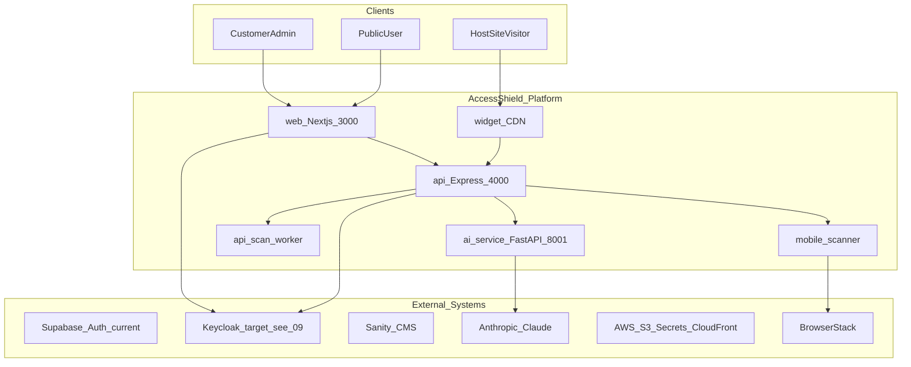

# AccessShield India — Architecture Documentation

Architecture reference for **Senior Architects** and **Technical Project Managers**. Covers local development and production target topology, with explicit labels for implemented vs planned components.

**Last updated:** July 2026  
**Monorepo:** Turborepo + pnpm 9 at repository root

---

## How to Read This Set

| Document                                                       | Purpose                                                                    |
| -------------------------------------------------------------- | -------------------------------------------------------------------------- |
| [01-system-overview.md](./01-system-overview.md)               | C4 context and container views; product capabilities; compliance standards |
| [02-monorepo-and-packages.md](./02-monorepo-and-packages.md)   | Apps, shared packages, API route map, web route structure                  |
| [03-data-and-multi-tenancy.md](./03-data-and-multi-tenancy.md) | Database schema, ER diagram, tenant isolation layers                       |
| [04-auth-and-security.md](./04-auth-and-security.md)           | Supabase JWT flow, RBAC, secrets, service-to-service auth                  |
| [05-scan-pipelines.md](./05-scan-pipelines.md)                 | Web, document, and mobile scan job flows                                   |
| [06-ai-and-integrations.md](./06-ai-and-integrations.md)       | AI microservice, external SaaS integration matrix                          |
| [07-deployment-topology.md](./07-deployment-topology.md)       | Local dev vs production deployment (AWS, Vercel, Supabase)                 |
| [08-operational-runbook.md](./08-operational-runbook.md)       | Startup order, ports, health checks, common failures                       |
| [09-self-hosting-supabase-replacement.md](./09-self-hosting-supabase-replacement.md) | Self-hosting design: replace Supabase Auth/Realtime with Keycloak + SSE |
| [10-docker-volumes-and-backup.md](./10-docker-volumes-and-backup.md) | Explicit Compose volume names, Keycloak DB on shared Postgres, backup priorities |
| [11-deployment-guide.md](./11-deployment-guide.md) | Step-by-step setup for local/dev and production servers |
| [12-linux-server-setup.md](./12-linux-server-setup.md) | Copy-paste Linux server setup (Docker installed; Compose infra + host apps) |
| [v2/](./v2/README.md) — Scan Pipeline Architecture v2 *(implemented behind flags)* | Staged task-queue workers, Redis + MQ, multi-scan consistency, migration plan |

**Suggested reading order:** 01 → 02 → 03 → 04, then 05–08 as needed for your role. Read 09 before any Supabase cutover work. For the **web-scan worker split (v2)**, read [v2/](./v2/README.md) after 05 — default deploy remains v1 until flags are enabled.

---

## Glossary

| Term                  | Definition                                                                                            |
| --------------------- | ----------------------------------------------------------------------------------------------------- |
| **Organisation**      | Tenant root entity. All customer data is scoped by `organisation_id`.                                 |
| **Asset**             | Something to scan or monitor: website, web app, mobile app, or document.                              |
| **Scan**              | A single accessibility audit run against an asset (web or mobile).                                    |
| **Scan page job**     | Per-URL unit of work within a web scan (table `scan_page_jobs`; pipeline v2).                         |
| **Violation**         | A rule failure found during a scan (axe-core, IS 17802, GIGW, mobile rules).                          |
| **Issue**             | Remediation ticket derived from violations; supports workflow, comments, AI fixes.                    |
| **Plan tier**         | Subscription level: `starter`, `professional`, `enterprise`, `government`. Gates features and limits. |
| **Widget**            | Embeddable JS SDK on customer sites; Shadow DOM, CDN-delivered.                                       |
| **Document scan job** | Async PDF/DOCX/PPTX/XLSX accessibility audit (separate from web `scans` table).                       |

---

## Diagram Legend

| Symbol / label                 | Meaning                                                |
| ------------------------------ | ------------------------------------------------------ |
| Solid boxes and arrows         | **Implemented** in the current codebase                |
| `(planned)` in titles or notes | Designed but not fully wired                           |
| `(stub)`                       | Route or UI exists; backend returns placeholder or 404 |
| Dashed style in text           | Future production target (e.g. AWS MQ, ElastiCache)    |

All diagrams use [Mermaid](https://mermaid.js.org/) for GitHub and wiki compatibility.

---

## Related Repository Docs

| Resource                         | Path                                                           |
| -------------------------------- | -------------------------------------------------------------- |
| Quick start                      | [`README.md`](../../README.md)                                 |
| Environment template             | [`.env.example`](../../.env.example)                           |
| Coding conventions               | [`.cursorrules`](../../.cursorrules)                           |
| Drizzle schema (source of truth) | [`packages/db/src/schema.ts`](../../packages/db/src/schema.ts) |
| API entry point                  | [`apps/api/src/index.ts`](../../apps/api/src/index.ts)         |
| Docker Compose (local infra)     | [`docker-compose.yml`](../../docker-compose.yml)               |

---

## Architecture at a Glance

**Interpretation:** Users interact via the Next.js portal or marketing site. Auth is Keycloak (Auth.js BFF). The API orchestrates scans and tenant data. Background workers process web and mobile jobs via RabbitMQ; document scans use Redis + the AI service. Realtime is API SSE + Redis ([09](./09-self-hosting-supabase-replacement.md)). AWS/MinIO stores artifacts.
