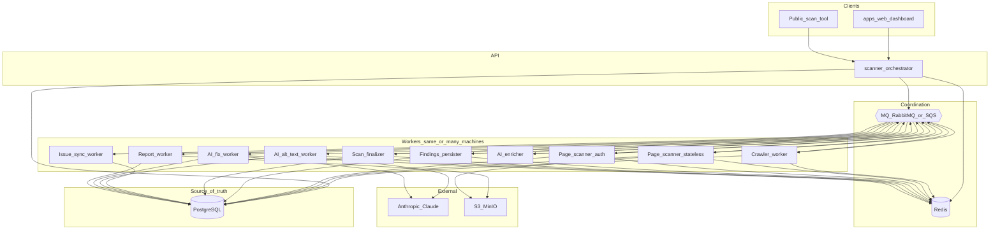
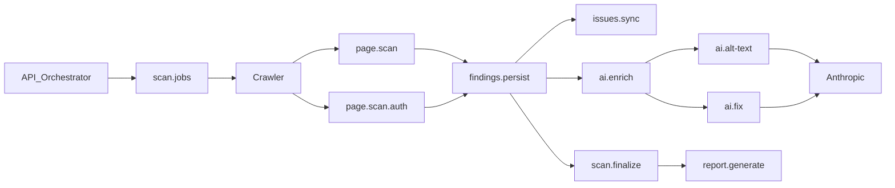
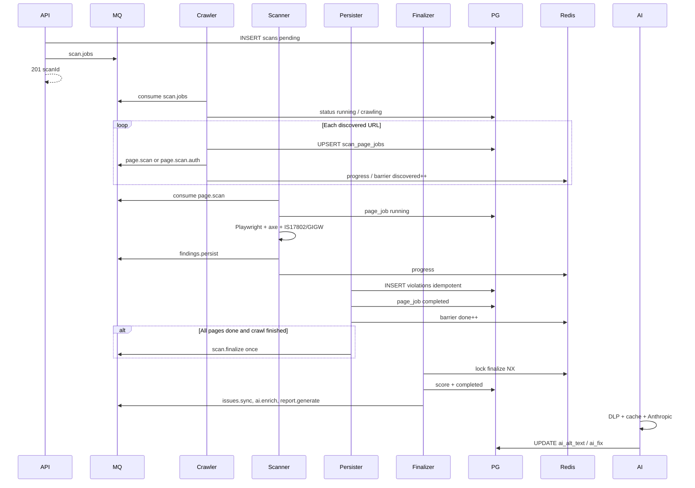

# 01 — Scan Pipeline Architecture v2

[← v2 Index](./README.md) | [Change Plan →](./02-scan-pipeline-change-plan.md)

## Executive Summary

Architecture v2 replaces the **monolithic web-scan worker** with a **staged task-queue pipeline**. Work is handed off as jobs across specialized workers (crawler, page scanners, persister, finalizer, AI, reports). **Redis** handles coordination (progress, cancel, barriers, rate limits, AI cache). **MQ** (RabbitMQ now; SQS later if needed) carries durable task messages.

**Status:** Implemented in `apps/api/src/scanner/v2/` behind feature flags (default = v1). Enable with `SCAN_PIPELINE_V2_SCAN_JOBS=true` on API + worker. See [PROGRESS.md](./PROGRESS.md) and [11 — Deployment](../11-deployment-guide.md).

**Approach:** staged task queues (pipeline of jobs) — **not** event streaming / Kafka.

**Goals:**

- Parallel page work and parallel **multi-scan** throughput
- Clear isolation per `scanId` + `organisationId`
- Lean infra so CPU/RAM go to Playwright and AI workers
- Fan-out to multiple machines without redesign

**Non-goals (v2):**

- Kafka / full event-sourcing bus
- Splitting Playwright navigation from axe-core (must stay together)
- Blocking scan completion on Anthropic calls

---

## Relationship to v1

| Aspect | v1 (default today) | v2 (flag on) |
| ------ | -------------- | ------------- |
| Worker | One process: crawl → scan → persist → score | Specialized consumers in same worker process (split later if needed) |
| Queues | `scans`, `scan_cancellations`, unused AI queues | Stage queues + real AI consumers |
| Discovery | Finish full `urls[]`, then scan | Stream URLs into page jobs as discovered |
| Concurrency | Fixed `SCAN_CONCURRENT_PAGES` (default 6) | Auto-N from machine; per-scan caps |
| Auth pages | Same path as public | Dedicated `page.scan.auth` (mostly sequential) |
| Progress truth | Redis progress | Redis hint + `scan_page_jobs` truth |
| AI | HTTP on-demand; MQ publish with no consumer | Async AI workers + optional HTTP |
| Broker | RabbitMQ + Redis | Redis + MQ (RabbitMQ or SQS) |

See also: [05 — Scan Pipelines](../05-scan-pipelines.md) (v1).

---

## Architecture Diagram



### Infra roles

| Component | Role | Examples |
| --------- | ---- | -------- |
| **MQ** | Durable task handoff | `scan.jobs`, `page.scan`, `findings.persist`, `ai.fix` |
| **Redis** | Ephemeral coordination | `scan:progress:{id}`, cancel flags, finalize locks, AI cache, rate limits |
| **PostgreSQL** | System of record | `scans`, `scan_page_jobs`, `violations`, `issues`, `reports` |
| **S3** | Artifacts | Screenshots, PDFs, DOM snapshots (optional) |

**Lean rule:** Do not colocate heavy Playwright workers with oversized broker footprints when possible. Prefer thin Redis + MQ; give CPU/RAM to scanners.

---

## Job Pipeline Diagram



### Sequence (single scan)



---

## Workers Catalog

### Control / orchestration

| Worker | Queue | Responsibility |
| ------ | ----- | -------------- |
| API Orchestrator | produces `scan.jobs` | Auth, plan limits, create scan row |
| Cancel handler | `scan.cancellations` | Set DB + Redis cancel; workers check each stage |
| Scan finalizer | `scan.finalize` | Score, complete scan, enqueue downstream |
| Watchdog (optional) | cron / `scan.watchdog` | Fail stuck scans |

### Discovery & analysis

| Worker | Queue | Responsibility |
| ------ | ----- | -------------- |
| Crawler | `scan.jobs` | Sitemap / deep crawl; stream page jobs |
| Page scanner (stateless) | `page.scan` | Public pages; concurrent; Playwright + axe + rules |
| Page scanner (auth) | `page.scan.auth` | Logged-in pages; mostly sequential |
| Screenshot / artifact (optional) | `page.artifacts` | S3 upload |

**Keep together:** Playwright navigation + axe-core + live India rules = one Page Scanner. Do not split “DOM parser” from the live browser for axe.

### Persistence

| Worker | Queue | Responsibility |
| ------ | ----- | -------------- |
| Findings persister | `findings.persist` | Batch insert violations; page_job completion; barrier |
| Issue sync | `issues.sync` | Create/update issues from violations |

### AI (Anthropic)

| Worker | Queue | Responsibility |
| ------ | ----- | -------------- |
| AI enricher | `ai.enrich` | Fan-out eligible violations |
| AI alt-text | `ai.alt-text` | Claude alt text → `violations.ai_alt_text` |
| AI fix | `ai.fix` | Claude fix → `ai_fix` / `ai_explanation` |
| Rate governor | wraps AI | Per-org / global RPM via Redis |

All AI paths: **DLP scrub** before Anthropic; Redis cache where allowed; **must not** block scan completion.

On-demand Issues UI may still call ai-service HTTP; prefer shared service functions with queue consumers.

### Reports & sibling pipelines

| Worker | Queue | Responsibility |
| ------ | ----- | -------------- |
| Report generator | `report.generate` | PDF/HTML packages → S3 |
| Document scan consumer | Redis `document-scan-jobs` | Existing ai-service path |
| Mobile scan worker | `mobile-scan-jobs` | Existing mobile path |

---

## Queue Catalog (MQ)

| Queue | Producer | Consumer |
| ----- | -------- | -------- |
| `scan.jobs` | API | Crawler |
| `page.scan` | Crawler | Page scanner (public) |
| `page.scan.auth` | Crawler / phase-2 | Auth scanner |
| `findings.persist` | Scanners | Persister |
| `issues.sync` | Persister / finalizer | Issue sync |
| `scan.finalize` | Barrier (after persist) | Finalizer |
| `ai.enrich` | Finalizer or persister | AI enricher |
| `ai.alt-text` | Enricher | AI alt-text |
| `ai.fix` | Enricher | AI fix |
| `report.generate` | Finalizer / API | Report worker |
| `scan.cancellations` | API | All workers (or flag-only via Redis) |

Prefetch guidance: scanners low (1–2), persister higher, AI workers low (rate limits).

---

## Multi-scan Consistency

Many website scans may run in parallel. Isolation rules:

1. Every MQ message includes `scanId`, `orgId`, `assetId` (+ `pageJobId` when page-scoped).
2. Every DB write is scoped by `organisation_id` + `scan_id`.
3. Redis keys are namespaced by `scanId`.
4. Idempotency on every stage (retries safe).
5. Finalize is **per scan**, using that scan’s `scan_page_jobs` barrier — never “queue is empty.”
6. Browser contexts are never shared across scans (auth context is per-scan).

### Postgres spine: `scan_page_jobs`

```text
scan_page_jobs
  id, organisation_id, scan_id, asset_id
  url, auth_required
  status: pending | queued | running | completed | failed | cancelled | skipped
  attempt, error_message, timestamps
  UNIQUE (scan_id, url_normalized)  -- idempotency
```

Indexes: `(scan_id, status)`, `(organisation_id, scan_id)`.

**Violations:** unique or upsert on `(scan_id, fingerprint)` so persist retries are safe.

### Redis keys

```text
scan:progress:{scanId}           → { pagesScanned, pagesTotal, currentUrl }
scan:cancel:{scanId}             → "1"  TTL 1h
scan:barrier:{scanId}            → optional counters; DB is source of truth
scan:lock:finalize:{scanId}      → SET NX — only one finalizer runs
ai:ratelimit:{orgId}             → sliding window
lock:scan-create:{orgId}         → optional; protect plan-limit races
```

**Progress is a hint; `scan_page_jobs` is truth for “can we finalize?”**

### Fairness under parallel scans

| Risk | Mitigation |
| ---- | ---------- |
| Scan A starves Scan B | Per-scan in-flight cap + global worker concurrency |
| Double finalize | Redis lock NX + DB status CAS (`scanning → finalizing → completed`) |
| Double violations | Unique `(scan_id, fingerprint)` |
| Cancel leaks | Cancel key + status check at start of every stage |
| Plan limit race | Transaction or Redis lock on org when creating scan |
| Shared Chromium cookies | New context per page; auth context **per scan** only |
| DB pool exhaustion | Separate pool sizes per worker type |
| Anthropic shared limit | Global + per-org Redis rate limiter |

---

## Message Contract (sketch)

```typescript
interface ScanJobMessage {
  scanId: string;
  orgId: string;
  assetId: string;
  assetUrl: string;
  config: ScanJobConfig;
  idempotencyKey: string; // scanId
}

interface PageScanMessage {
  scanId: string;
  orgId: string;
  assetId: string;
  pageJobId: string;
  url: string;
  authRequired: boolean;
  config: ScanJobConfig;
  idempotencyKey: string; // scanId + normalizedUrl
}

interface FindingsPersistMessage {
  scanId: string;
  orgId: string;
  pageJobId: string;
  findings: RawViolation[];
  idempotencyKey: string; // pageJobId + attempt
}
```

Full Zod schemas belong in `packages/types` at implementation time.

---

## Worker Stage Behaviors (summary)

### Crawler

1. Claim scan → `running` / `crawling`
2. Discover URLs (stream as you go)
3. For each URL: upsert `scan_page_jobs` → publish `page.scan` or `page.scan.auth`
4. Set discovered count; if crawl done and discovered = 0 → fail scan
5. Check `scan:cancel:{scanId}` between batches

### Page scanner (stateless)

1. Skip if cancel or page_job already `completed`
2. Mark page_job `running`
3. Playwright + axe + IS17802/GIGW
4. Publish `findings.persist`
5. On hard fail: page_job `failed`, still counts toward barrier

### Auth scanner

Same as page scanner, but concurrency **1–2** with a dedicated login session per scan.

### Persister

1. Idempotent insert violations for `scanId`
2. Mark page_job `completed`
3. Update barrier counts
4. If `completed + failed == discovered` **and** crawl finished → publish `scan.finalize` **once**

### Finalizer

1. Lock `scan:lock:finalize:{scanId}`
2. Re-check barrier in DB
3. Score; update `scans` and `assets.lastScannedAt`
4. Enqueue `issues.sync`, `ai.enrich`, optionally `report.generate`
5. Clear progress keys

### AI workers

DLP → cache → Anthropic → update that `violationId`. Failures do not fail the scan.

---

## Status Lifecycle

```text
pending → crawling → scanning → persisting → finalizing → completed
                         ↘ failed / cancelled
```

UI may continue to show `pending | running | completed | failed` by mapping intermediate states to `running`.

---

## Performance Expectations

| Metric | Expected vs v1 monolith |
| ------ | ----------------------- |
| Single-scan latency (typical) | **~10–25%** faster with streaming + right concurrency |
| Single-scan latency (best case) | **~30–50%** if crawl was slow and CPU was underused |
| Multi-scan throughput | **~50–200%+** with multiple scanner workers/machines |
| Queue split alone | **~0%** latency; enables scale |

Bottlenecks remain: page `goto` + axe-core + Anthropic RPM.

What moves the needle most:

1. More page-scan capacity (workers × concurrency) → throughput
2. Right concurrency for the machine → single-scan page phase
3. Stream crawl → scan → helps when crawl is not instant
4. Queue split → scalability/reliability; not magic latency by itself

---

## Local & Deploy Notes

```bash
# v1 today
pnpm --filter @accessshield/api dev:worker

# v2 target (illustrative)
pnpm --filter @accessshield/api worker:crawler
pnpm --filter @accessshield/api worker:page-scan
pnpm --filter @accessshield/api worker:persist
pnpm --filter @accessshield/api worker:finalize
pnpm --filter @accessshield/ai-service worker:ai   # alt-text + fix consumers
```

Requires: PostgreSQL, Redis, MQ, (optional) S3/MinIO.

---

## References

- Change plan: [02 — Scan Pipeline v2 Change Plan](./02-scan-pipeline-change-plan.md)
- v1 pipelines: [05 — Scan Pipelines](../05-scan-pipelines.md)
- AI service: [06 — AI and Integrations](../06-ai-and-integrations.md)
- Deployment: [11 — Deployment Guide](../11-deployment-guide.md)
- `.cursorrules` — API, multi-tenancy, DLP, plan limits
