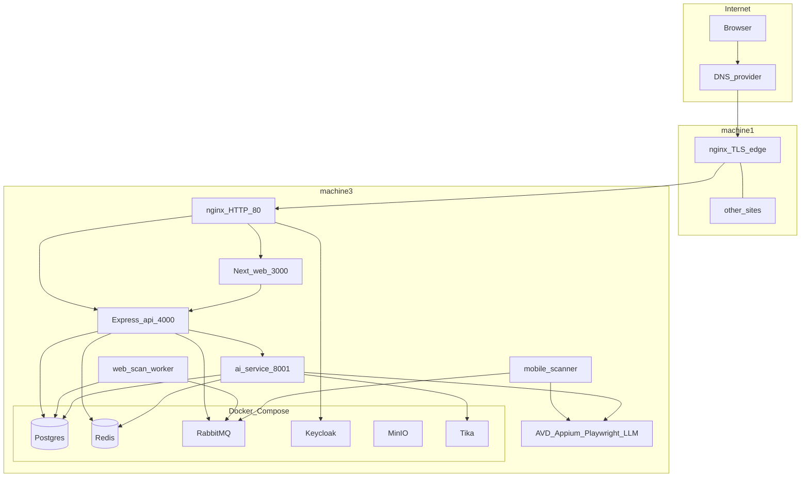

# 01 — Architecture & components

[← Index](./README.md) | [Next: Artifacts & scripts →](./02-artifacts-and-scripts.md)

## 1. Deployment components



| Component | Process | Port | Role |
| --- | --- | --- | --- |
| Edge nginx | system nginx (machine1) | 443/80 | Terminate TLS; host-based proxy to machine3 |
| Host nginx | system nginx (machine3) | 80 | Path/host split to web, API, Keycloak |
| Web | Next.js 14 App Router | 3000 | Marketing + dashboard |
| API | Express + TypeScript | 4000 | REST `/api/v1`, `/health` |
| Web scan worker | `@accessshield/api` worker | — | RabbitMQ consumers (v1/v2) |
| Mobile scanner | `@accessshield/mobile-scanner` | — | `mobile-scan-jobs` + Appium |
| AI service | FastAPI / uvicorn | 8001 | Alt-text, fixes, document consumer |
| Postgres | Compose | host mapping in Compose | App DB + Keycloak DB |
| Redis | Compose | 6379 | Cache, progress, document queue |
| RabbitMQ | Compose | 5672 / 15672 | Scan queues |
| Keycloak | Compose | 8080 | OIDC (`$AUTH_DOMAIN`) |
| MinIO | Compose | 9000/9001 | S3-compatible objects |
| Tika | Compose | 9998 | Document text extraction |
| Host tools | OS packages / SDK | 4723 Appium | AVD, Playwright Chromium, local GGUF |

## 2. Frameworks & tools (pinned for this topology)

| Layer | Stack |
| --- | --- |
| Monorepo | Turborepo, pnpm 9, Node 20 |
| Web | Next.js 14, Auth.js, TanStack Query, Tailwind |
| API / workers | Express, Drizzle, Playwright, axe-core, amqplib |
| Mobile | WebdriverIO, Appium 2, UiAutomator2, local AVD |
| AI | FastAPI, Pydantic v2, Anthropic SDK and/or llama-cpp |
| Auth | Keycloak OIDC |
| Data | PostgreSQL 16, Redis 7, RabbitMQ 3.13 |
| Objects | MinIO (self-host) → S3-compatible API |
| Edge | nginx, certbot (Let's Encrypt) |

## 3. Public request path

```
https://$DOMAIN/
  → edge firewall → machine1:443
  → proxy_pass http://$MACHINE3_IP:80
  → machine3 nginx
  → 127.0.0.1:3000 (Next)

https://$DOMAIN/api/v1/…
  → same edge → machine3 → 127.0.0.1:4000

https://$AUTH_DOMAIN/…
  → same edge → machine3 → 127.0.0.1:8080 (Keycloak)
```

## 4. Scan / AI data paths (machine3 only)

| Flow | Queue / call | Workers |
| --- | --- | --- |
| Website scan | RabbitMQ `scans` or v2 `scan.jobs`… | `deploy.sh` → `worker` |
| Mobile scan | RabbitMQ `mobile-scan-jobs` | `mobile` + Appium/AVD |
| Document scan | Redis `document-scan-jobs` | ai-service lifespan consumer + Tika |
| AI remediation | HTTP API → ai-service; v2 also RabbitMQ AI queues | ai-service + worker |

Host tools (Android SDK, AVD, Appium, Playwright, LLM weights) live on **machine3** next to the apps — not on machine1.
