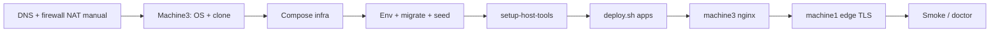

# AccessibleNow — Self-Hosted Deployment

**Canonical deployment guide** for the current production topology (edge firewall → machine1 → machine3 apps).  
Product name: **AccessibleNow** (public site domain configured in `deploy/env.sh`). Monorepo package names may still say `@accessshield/*`.

---

## How to read (top-down)

| # | Document | What you get |
| --- | --- | --- |
| 1 | **[01 — Architecture & components](./01-architecture-and-components.md)** | Boxes, ports, tools/frameworks, request path |
| 2 | **[02 — Artifacts & scripts](./02-artifacts-and-scripts.md)** | What lives in the repo + script map (which host, when) |
| 3 | **[03 — Network & edge](./03-network-and-edge.md)** | DNS, firewall/NAT, machine1/machine3 nginx, TLS |
| 4 | **[04 — Machine3 platform](./04-machine3-platform.md)** | OS, Compose infra, env, `deploy.sh` apps |
| 5 | **[05 — Host tools](./05-host-tools.md)** | Android/AVD/Appium, Playwright, local LLM |
| 6 | **[06 — Database & auth](./06-database-and-auth.md)** | Migrations, seed, Keycloak, platform admin |
| 7 | **[07 — Day-2 operations](./07-day-2-operations.md)** | Updates, doctor, smoke, rollback, manuals |

**Audience:** developers bringing up the stack + ops running machine1 (edge) and machine3 (apps).

---

## Quick path (first production box)

Ordered steps (details in linked docs):

1. **Manual:** DNS A/CNAME for apex, `www`, and `auth` → public IP; firewall DNAT to machine1; LAN allow machine1 → machine3:80; BIOS KVM if using local Android emulator.
2. **machine3:** Node 20, pnpm 9, Docker Compose → clone repo → `.env.local` + `apps/ai-service/.env` → `docker compose up -d …` → `./scripts/deploy.sh --bootstrap` (or migrate + seed).
3. **machine3:** `./scripts/setup-host-tools.sh` then `doctor`.
4. **machine3:** `cp deploy/env.example deploy/env.sh` → set `MACHINE1_IP` / `MACHINE3_IP` / domains → `sudo bash deploy/scripts/setup-machine3-nginx.sh`.
5. **machine1:** same `env.sh` → `sudo bash deploy/scripts/setup-machine1-proxy.sh` → `bash deploy/scripts/check-connectivity.sh`.
6. Login at `https://<DOMAIN>/login` as the seeded platform admin (see [06](./06-database-and-auth.md)).

---

## Machines at a glance

| Role | Host | Address | Runs |
| --- | --- | --- | --- |
| Edge | machine1 | `$MACHINE1_IP` in `deploy/env.sh` | nginx + Let's Encrypt; host-based proxy to machine3 (may share the box with other products) |
| Apps | machine3 | `$MACHINE3_IP` in `deploy/env.sh` | Compose infra + web/api/workers/ai/mobile + host-tools + host nginx :80 |

Public DNS must point at the **public** WAN IP (DNAT to machine1), never at machine3’s LAN address.

---

## Manual forever (scripts do not automate)

| Item | Owner |
| --- | --- |
| BIOS VT-x / AMD-V for `/dev/kvm` | Ops on machine3 |
| Edge firewall DNAT + cross-subnet LAN rule | Network |
| DNS provider records | Ops |
| Other products’ nginx site files on machine1 | Do not modify from AccessibleNow scripts |
| First Keycloak realm client redirect URIs for prod HTTPS | After seed / realm import |

---

## Related architecture docs

- System overview: [../architecture/01-system-overview.md](../architecture/01-system-overview.md)
- Scan pipelines: [../architecture/05-scan-pipelines.md](../architecture/05-scan-pipelines.md)
- Volumes / backup: [../architecture/10-docker-volumes-and-backup.md](../architecture/10-docker-volumes-and-backup.md)
- AWS/Vercel target (future): [../architecture/07-deployment-topology.md](../architecture/07-deployment-topology.md)
